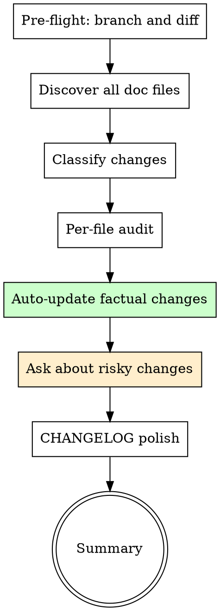

# Document Sync

Ensure every documentation file in the project matches what the code actually does. Reads all docs, cross-references the diff, auto-fixes factual drift, asks before subjective changes.

**Origin:** Patterns extracted from gstack `/document-release` (per-file audit heuristics, auto-update vs ask-user classification, CHANGELOG preservation rules).

## The Iron Law

```
NO SHIPPED CODE WITHOUT MATCHING DOCUMENTATION
```

Stale docs are worse than no docs — they actively mislead. Every code change that affects documented behavior must update the docs in the same PR.

## When to Use

- After `ship-and-pr` creates a PR (ship-and-pr Step 7 suggests this)
- After merging code that changes behavior
- When the user says "update the docs" or "are the docs current?"
- Before major releases (full doc sweep)

## When NOT to Use

- Pure refactoring with no behavior change
- Test-only changes
- Changes to files that no documentation references

## Process Flow



## Step 1: Pre-flight & Diff Analysis

```bash
# Current branch
BRANCH=$(git branch --show-current)

# Base branch
BASE=$(git rev-parse --abbrev-ref HEAD@{upstream} 2>/dev/null | sed 's|origin/||' || echo "main")

# What changed
git fetch origin "$BASE" --quiet 2>/dev/null
git diff "origin/$BASE" --stat
git log "origin/$BASE..HEAD" --oneline
git diff "origin/$BASE" --name-only
```

If on the base branch with no diff: "No changes to sync. Documentation is current." → STOP.

## Step 2: Discover All Doc Files

Find all Markdown files in the project (excluding noise):

Use the native file-search tool (Glob) to find `**/*.md` files, excluding:
- `.git/`
- `node_modules/`
- `vendor/`
- `.context/`
- Lock files

Typical doc files to prioritize:
- `README.md`
- `ARCHITECTURE.md`
- `CONTRIBUTING.md`
- `CLAUDE.md` / `AGENTS.md`
- `CHANGELOG.md`
- `docs/**/*.md`
- `API.md`
- Any `.md` file at root level

Output: "Found N documentation files to review against M changed files."

## Step 3: Classify Changes

Categorize the code diff into documentation-relevant categories:

| Category | What changed | Doc impact |
|----------|-------------|-----------|
| **New feature** | New files, new routes, new commands | README needs update, might need new doc |
| **Changed behavior** | Modified APIs, updated config, changed defaults | README/API docs need update |
| **Removed feature** | Deleted files, removed commands | README/API docs need removal |
| **Infrastructure** | Build, CI, deployment, dependencies | CONTRIBUTING/setup docs need update |
| **Renamed/moved** | File renames, path changes | All docs referencing old paths |

## Step 4: Per-File Documentation Audit

Read each documentation file and cross-reference against the diff.

### README.md
- Does it describe all features visible in the diff?
- Are install/setup instructions consistent with changes?
- Are examples and usage descriptions still valid?
- Are listed commands/CLIs still accurate?
- Are count numbers (e.g., "23 skills") still correct?

### ARCHITECTURE.md
- Do component descriptions match current code?
- Are diagrams still accurate?
- Be conservative — only update things clearly contradicted by the diff

### CONTRIBUTING.md
- Walk through setup instructions as a new contributor — would they work?
- Are test commands and dev scripts accurate?
- Do workflow descriptions match current process?

### CLAUDE.md / AGENTS.md
- Does the project structure section match the actual file tree?
- Are listed commands and scripts accurate?
- Do build/test instructions match what's in package.json (or equivalent)?

### Other .md files
- Read the file, determine its purpose
- Cross-reference against the diff for contradictions

### Classify each needed update:

| Classification | When | Action |
|---------------|------|--------|
| **Auto-update** | Factual correction clearly from the diff: path, count, command name, table entry | Fix directly |
| **Ask user** | Narrative change, section removal, large rewrite (10+ lines), security model, ambiguous | Ask before changing |
| **No change needed** | File is accurate relative to the diff | Skip |

## Step 5: Apply Auto-Updates

Make all factual corrections directly using the Edit tool.

For each file modified, output a one-line summary:
```
README.md: updated skill count from 6 to 9, added /e2e-browser-test to skill table
CLAUDE.md: updated project structure tree, added document-sync to routing rules
```

**Never auto-update:**
- README introduction or project positioning
- Architecture philosophy or design rationale
- Security model descriptions
- Remove entire sections

## Step 6: Ask About Risky Changes

For each risky or questionable update, ask the user:

```
Context: Reviewing <file> against the diff on branch <branch>.
Question: <specific documentation decision>
RECOMMENDATION: Choose <X> because <reason>
Options:
  A) <proposed change>
  B) <alternative>
  C) Skip — leave as-is
```

Apply approved changes immediately after each answer.

## Step 7: CHANGELOG Polish (if changed)

**CRITICAL: NEVER overwrite, replace, or regenerate CHANGELOG entries.**

If CHANGELOG.md was modified in this branch:

1. Read the entire CHANGELOG.md
2. Only polish wording within existing entries — never delete, reorder, or replace
3. Ensure voice is user-facing: "You can now..." not "Refactored the..."
4. If an entry looks wrong, ask the user — don't silently fix

If CHANGELOG was NOT modified in this branch: skip this step entirely.

## Step 8: Summary

```markdown
## Document Sync Report

**Branch:** <branch> → <base>
**Doc files reviewed:** <N>
**Changes made:** <N> auto-updates, <N> user-approved

### Updates Made

| File | Change |
|------|--------|
| README.md | Updated skill count, added new command to table |
| CLAUDE.md | Updated project structure tree |

### Skipped (no changes needed)

| File | Reason |
|------|--------|
| ARCHITECTURE.md | No contradictions found |

### User Decisions

| File | Question | Decision |
|------|----------|----------|
| CONTRIBUTING.md | Add new test command? | Approved |

### Status: SYNCED / PARTIALLY SYNCED
```

## Red Flags — STOP

| Thought | Reality |
|---------|---------|
| "Docs aren't important" | Stale docs actively harm new contributors and future you. |
| "I'll update docs later" | You won't. Do it now while the diff is fresh in context. |
| "Only README matters" | CLAUDE.md, CONTRIBUTING.md, and ARCHITECTURE.md drift just as fast. |
| "Just regenerate the whole file" | Never regenerate — you'll lose hand-written context. Edit surgically. |
| "The CHANGELOG entry looks wrong, I'll fix it" | ASK first. CHANGELOG entries are written from real diffs — they are the source of truth. |

## Integration with Superpowers

- **Before this skill:** `ship-and-pr` creates the PR and suggests doc sync (Step 7)
- **After this skill:** Commit doc updates to the same branch, push to update the PR
- **Complements:** `knowledge-compound` — docs describe what IS; learnings describe what was LEARNED
- **Knowledge output:** If doc sync reveals a recurring drift pattern (same file always goes stale), suggest `knowledge-compound` Knowledge track
