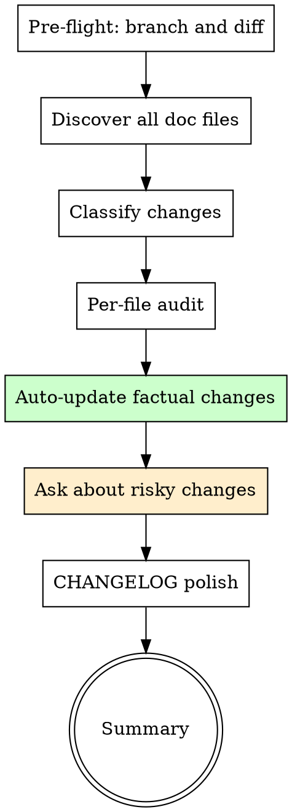

# Document Sync

Ensure every documentation file in the project matches what the code actually does. Reads all docs, cross-references the diff, auto-fixes factual drift, asks before subjective changes.

**Origin:** Patterns extracted from gstack `/document-release` (per-file audit heuristics, auto-update vs ask-user classification, CHANGELOG preservation rules).

## The Iron Law

```
NO SHIPPED CODE WITHOUT MATCHING DOCUMENTATION
```

Stale docs are worse than no docs — they actively mislead. Every code change that affects documented behavior must update the docs in the same PR.

## When to Use

- After `ship-and-pr` creates a PR (ship-and-pr Step 7 suggests this)
- After merging code that changes behavior
- When the user says "update the docs" or "are the docs current?"
- Before major releases (full doc sweep)

## When NOT to Use

- Pure refactoring with no behavior change
- Test-only changes
- Changes to files that no documentation references

## Process Flow



## Step 1: Pre-flight & Diff Analysis

```bash
# Current branch
BRANCH=$(git branch --show-current)

# Base branch
BASE=$(git rev-parse --abbrev-ref HEAD@{upstream} 2>/dev/null | sed 's|origin/||' || echo "main")

# What changed
git fetch origin "$BASE" --quiet 2>/dev/null
git diff "origin/$BASE" --stat
git log "origin/$BASE..HEAD" --oneline
git diff "origin/$BASE" --name-only
```

If on the base branch with no diff: "No changes to sync. Documentation is current." → STOP.

## Step 2: Discover All Doc Files

Find all Markdown files in the project (excluding noise):

Use the native file-search tool (Glob) to find `**/*.md` files, excluding:
- `.git/`
- `node_modules/`
- `vendor/`
- `.context/`
- Lock files

Typical doc files to prioritize:
- `README.md`
- `ARCHITECTURE.md`
- `CONTRIBUTING.md`
- `CLAUDE.md` / `AGENTS.md`
- `CHANGELOG.md`
- `docs/**/*.md`
- `API.md`
- Any `.md` file at root level

Output: "Found N documentation files to review against M changed files."

## Step 3: Classify Changes

Categorize the code diff into documentation-relevant categories:

| Category | What changed | Doc impact |
|----------|-------------|-----------|
| **New feature** | New files, new routes, new commands | README needs update, might need new doc |
| **Changed behavior** | Modified APIs, updated config, changed defaults | README/API docs need update |
| **Removed feature** | Deleted files, removed commands | README/API docs need removal |
| **Infrastructure** | Build, CI, deployment, dependencies | CONTRIBUTING/setup docs need update |
| **Renamed/moved** | File renames, path changes | All docs referencing old paths |

## Step 4: Per-File Documentation Audit

Read each documentation file and cross-reference against the diff.

### README.md
- Does it describe all features visible in the diff?
- Are install/setup instructions consistent with changes?
- Are examples and usage descriptions still valid?
- Are listed commands/CLIs still accurate?
- Are count numbers (e.g., "23 skills") still correct?

### ARCHITECTURE.md
- Do component descriptions match current code?
- Are diagrams still accurate?
- Be conservative — only update things clearly contradicted by the diff

### CONTRIBUTING.md
- Walk through setup instructions as a new contributor — would they work?
- Are test commands and dev scripts accurate?
- Do workflow descriptions match current process?

### CLAUDE.md / AGENTS.md (high-stakes — drives Claude Code session behavior)

**Why elevated:** unlike README which a human reads, CLAUDE.md is loaded into every Claude Code session as system instructions. Drift here changes Claude's actual behavior, not just documentation accuracy. Token cost is paid every session, on every prompt.

**Diff-driven section targeting** — choose checks based on what changed:

| Diff touches | Audit these CLAUDE.md sections |
|---|---|
| `api/`, route handlers | Endpoint enumerations + counts |
| `Makefile`, `package.json`, `Cargo.toml`, `pyproject.toml` | Build/Test Commands |
| Top-level dir add/rename/delete | Project Structure paragraph |
| Public function signatures | Architecture paragraphs (grep referenced symbols) |
| Config schema files | JSON/YAML code-block examples |

**Counted enumerations** — find `(N total)` / `N skills` / `N endpoints` patterns; count actual bullets that follow; flag count mismatches.

**Path/package references** — extract every backtick-quoted path (`agent/`, `cli/commands/main.go`); verify each exists; flag missing.

**Endpoint route validation** — if HTTP routes enumerated, grep code for route definitions; flag missing-from-doc or missing-from-code.

**Symbol references** — function/method names mentioned in prose (e.g., `Foo.NewBar(...)`); grep code for definition; flag if absent or signature differs.

**Auto-update vs ask gate is TIGHTER for CLAUDE.md** — pruning ALWAYS asks; only mechanical replacements are auto:

- Auto-update: count-only corrections; rename clearly inferable from the diff (path or command renamed); table-row text fix that doesn't delete a row
- **Ask** (do not auto-update): missing-path removal, section deletion, list-item removal, link-out / move-to-doc, removal-on-feature-removal, any addition that grows file >5% or pushes over the CLAUDE.md soft cap (~1500 estimated tokens; defined in Step 4.7 below)

**Hard rule:** any operation that REMOVES content from CLAUDE.md MUST ask the user. Pruning requires human judgment about what context Claude actually needs in-session.

### Other .md files
- Read the file, determine its purpose
- Cross-reference against the diff for contradictions

### Classify each needed update:

| Classification | When | Action |
|---------------|------|--------|
| **Auto-update** | Factual correction clearly from the diff: path, count, command name, table entry | Fix directly |
| **Ask user** | Narrative change, section removal, large rewrite (10+ lines), security model, ambiguous | Ask before changing |
| **No change needed** | File is accurate relative to the diff | Skip |

## Step 4.7: CLAUDE.md Hygiene Audit (size + inflation pressure)

**Why this step exists:** CLAUDE.md is loaded into every session. Each line costs tokens forever, on every prompt. Drift goes both ways — content can become stale (need update) AND content can become irrelevant (need removal). Step 4 handles the first; this step handles the second.

**Modes:**
- **Auto (default):** runs only if the diff touches `CLAUDE.md` OR file size is over soft cap. Otherwise skipped silently to keep PR-time audits cheap.
- **Forced full sweep (`--full-sweep` flag, or skill invocation phrase "audit CLAUDE.md hygiene"):** runs all hygiene checks regardless of diff/size. Used for monthly hygiene reviews, release pre-flights, and empirical validation of this skill itself.

### Measure size

```bash
lines=$(wc -l < CLAUDE.md)
chars=$(wc -m < CLAUDE.md)
non_ascii=$(LC_ALL=C grep -o '[^[:print:][:space:]]' CLAUDE.md | wc -l)
ratio=$(( chars > 0 ? non_ascii * 100 / chars : 0 ))
if [ "$ratio" -gt 30 ]; then
  estimated_tokens=$(( chars / 2 ))   # CJK-heavy
else
  estimated_tokens=$(( chars / 4 ))   # English / code-heavy
fi
echo "lines=$lines chars=$chars non_ascii_ratio=${ratio}% estimated_tokens=$estimated_tokens"
```

Caps are **token estimates**, not line counts:
- Soft cap: 1500 tokens
- Hard cap: 3000 tokens

If over soft cap → warn user, treat all hygiene candidates as "ask".
If over hard cap → refuse to ADD content; only prune/replace permitted.

### Detect upstream CLAUDE.md (report-only, do NOT scan)

```bash
for dir in "$PWD/.." "$PWD/../.." "$HOME/.claude"; do
  [ -f "$dir/CLAUDE.md" ] && echo "Note: upstream CLAUDE.md at $dir/CLAUDE.md (not in v1.3 scope)"
done
```

If found, report the path so the user knows it exists, but DO NOT scan or modify it. Cross-repo handling is a v1.4+ topic.

### Inflation pattern detection

For each pattern, detect candidates and propose action. **Always ASK before mutating** — pruning requires human judgment about what context Claude actually needs in-session.

| Pattern | Detection | Proposed action |
|---|---|---|
| Verbatim list >5 items inline | Bullets after `(N total)` or numbered list | Move to dedicated doc; leave summary + link |
| Phase narrative with 2+ phases | `Phase X.0` count >1 | Keep current phase; archive older to spec docs |
| Architectural detail accretion (≥3 non-list paragraphs in one H2/H3 section) | Count `\n\n`-separated non-list paragraphs between consecutive H2/H3 boundaries | Flag for human review |
| Scar tissue prose | grep `used to|previously|legacy|formerly|in v[0-9]` | Ask "still load-bearing?" |
| Code blocks >10 lines | Lines between ``` markers | Move to schema file; leave reference |
| Rule list >10 items | `^-` bullets in same list | Ask: consolidate or link to convention doc |

### Removal-on-feature-removal

When the diff DELETES a feature (function/route/command/config field), also propose deleting its CLAUDE.md description. The current skill is additive-only — this closes that gap.

### Date-stamp staleness

Find date markers in two **explicit** forms only:
- Parenthesized: `(Month YYYY)` — e.g., `(April 2026)`
- Inline: `as of YYYY-MM` — e.g., `as of 2025-09`

Do NOT match `since YYYY` (too broad — false-positives on license years, compatibility statements, design history). Do NOT match generic dates inside JSON examples or commit-message blocks.

If the date is >6 months old AND the diff doesn't touch nearby code in the same section, ask: "still accurate? still relevant for current contributors?"

### Output

```
## CLAUDE.md Hygiene Report
- Current size: <N> lines / ~<M> estimated tokens (vs 1500 soft cap)
- Mode: <auto | forced full sweep>
- Upstream CLAUDE.md detected: <path or "none">
- Inflation candidates: <list with line refs + proposed action>
- Removal candidates (feature removed in diff): <list>
- Stale-date candidates: <list with date markers>
```

User decides per candidate. Approved actions apply in Step 5.

## Step 5: Apply Auto-Updates

Make all factual corrections directly using the Edit tool.

For each file modified, output a one-line summary:
```
README.md: updated skill count from 6 to 9, added /e2e-browser-test to skill table
CLAUDE.md: updated project structure tree, added document-sync to routing rules
```

**Never auto-update:**
- README introduction or project positioning
- Architecture philosophy or design rationale
- Security model descriptions
- Remove entire sections

## Step 6: Ask About Risky Changes

For each risky or questionable update, ask the user:

```
Context: Reviewing <file> against the diff on branch <branch>.
Question: <specific documentation decision>
RECOMMENDATION: Choose <X> because <reason>
Options:
  A) <proposed change>
  B) <alternative>
  C) Skip — leave as-is
```

Apply approved changes immediately after each answer.

## Step 7: CHANGELOG Polish (if changed)

**CRITICAL: NEVER overwrite, replace, or regenerate CHANGELOG entries.**

If CHANGELOG.md was modified in this branch:

1. Read the entire CHANGELOG.md
2. Only polish wording within existing entries — never delete, reorder, or replace
3. Ensure voice is user-facing: "You can now..." not "Refactored the..."
4. If an entry looks wrong, ask the user — don't silently fix

If CHANGELOG was NOT modified in this branch: skip this step entirely.

## Step 8: Summary

```markdown
## Document Sync Report

**Branch:** <branch> → <base>
**Doc files reviewed:** <N>
**Changes made:** <N> auto-updates, <N> user-approved

### Updates Made

| File | Change |
|------|--------|
| README.md | Updated skill count, added new command to table |
| CLAUDE.md | Updated project structure tree |

### Skipped (no changes needed)

| File | Reason |
|------|--------|
| ARCHITECTURE.md | No contradictions found |

### User Decisions

| File | Question | Decision |
|------|----------|----------|
| CONTRIBUTING.md | Add new test command? | Approved |

### Status: SYNCED / PARTIALLY SYNCED
```

## Red Flags — STOP

| Thought | Reality |
|---------|---------|
| "Docs aren't important" | Stale docs actively harm new contributors and future you. |
| "I'll update docs later" | You won't. Do it now while the diff is fresh in context. |
| "Only README matters" | CLAUDE.md, CONTRIBUTING.md, and ARCHITECTURE.md drift just as fast. |
| "Just regenerate the whole file" | Never regenerate — you'll lose hand-written context. Edit surgically. |
| "The CHANGELOG entry looks wrong, I'll fix it" | ASK first. CHANGELOG entries are written from real diffs — they are the source of truth. |

## Integration with Superpowers

- **Before this skill:** `ship-and-pr` creates the PR and suggests doc sync (Step 7)
- **After this skill:** Commit doc updates to the same branch, push to update the PR
- **Complements:** `knowledge-compound` — docs describe what IS; learnings describe what was LEARNED. When suggesting `knowledge-compound`, follow `learnings-protocol.md` WRITE phase requirements (`track` / `status` / cross-reference).
- **Knowledge output:** If doc sync reveals a recurring drift pattern (same file always goes stale), suggest `knowledge-compound` Knowledge track
