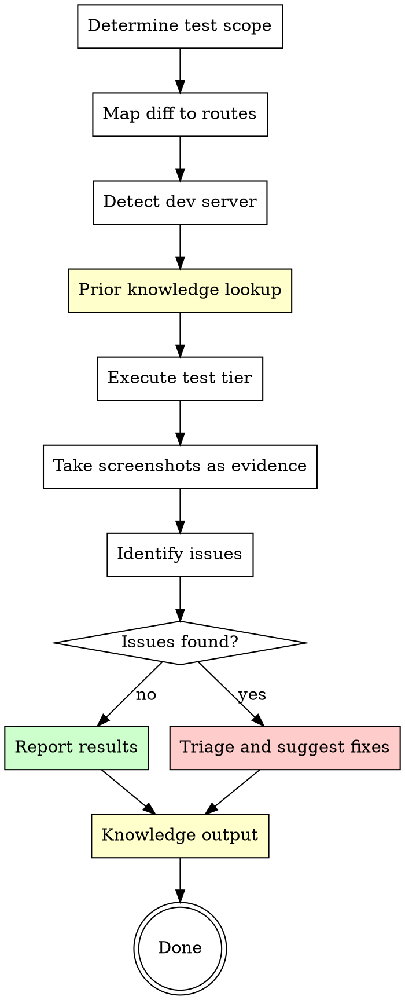

# End-to-End Browser Testing

Test your application like a real user — open pages, click elements, fill forms, take screenshots, verify state. Focused on pages affected by the current diff.

**Origin:** Patterns extracted from compound-engineering `test-browser` (agent-browser integration, diff→route mapping) and gstack `/qa` (explore→identify→triage→fix→verify methodology, three-tier severity).

## The Iron Law

```
NO "IT WORKS" CLAIM WITHOUT BROWSER VERIFICATION
```

Unit tests verify logic. Browser tests verify that the user can actually see and use the feature. Both are necessary, neither is sufficient alone.

## Prerequisites

- `agent-browser` CLI installed globally
- A running local dev server (or a staging URL)

### Setup Check

```bash
command -v agent-browser >/dev/null 2>&1 && echo "agent-browser: Ready" || echo "agent-browser: NOT INSTALLED — run: npm install -g agent-browser && agent-browser install"
```

If not installed, inform the user and stop.

## When to Use

- After implementing a feature (before `structured-review`)
- After fixing a UI-related bug (verify the fix visually)
- Before major releases (regression sweep)
- When the user says "does this work?" or "test the page"

## Tiers

| Tier | Scope | When |
|------|-------|------|
| **Quick** | Smoke test: page loads, no console errors, key elements visible | Default for small changes |
| **Standard** | Functional: forms submit, navigation works, states change correctly | Default for medium changes |
| **Exhaustive** | All states: error states, empty states, edge cases, responsive breakpoints | Before major releases or user requests |

If the user doesn't specify a tier, auto-select based on diff size:
- < 5 files changed → Quick
- 5-15 files changed → Standard
- 15+ files or user says "thorough" → Exhaustive

## Process Flow



## Step 1: Determine Test Scope

**If URL provided:** Test that URL directly.

**If PR number provided:**
```bash
gh pr view <number> --json files -q '.files[].path'
```

**If 'current' or no argument:**
```bash
BASE=$(git merge-base HEAD "origin/$(git rev-parse --abbrev-ref HEAD@{upstream} 2>/dev/null | sed 's|origin/||' || echo main)" 2>/dev/null || echo "HEAD~1")
git diff "$BASE" --name-only
```

## Step 2: Map Changed Files to Routes

Map each changed file to testable URLs based on framework conventions:

| File Pattern | Route(s) |
|-------------|----------|
| `app/views/<resource>/*`, `pages/<resource>/*` | `/<resource>`, `/<resource>/:id` |
| `*controller*`, `*route*`, `*endpoint*` | Corresponding API/page routes |
| `*component*`, `*.tsx`, `*.vue`, `*.svelte` | Pages that render the component |
| `*layout*`, `*template*` | All pages (test homepage at minimum) |
| `*.css`, `*.scss`, `*styles*` | Visual regression on key pages |
| `*middleware*`, `*auth*` | Auth-gated pages |
| `static/*`, `public/*` | Homepage + any page referencing the asset |

If the mapping produces no routes, ask the user for the test URL.

## Step 3: Detect Dev Server

```bash
# Check common ports
for port in 3000 3001 4000 5000 5173 8000 8080; do
  curl -s -o /dev/null -w "%{http_code}" "http://localhost:$port" 2>/dev/null | grep -q "200\|301\|302" && echo "Server found on port $port" && break
done
```

If `--port` was specified, use that port. If no server found, ask the user to start one.

## Step 4: Lookup Prior Knowledge

Follow `learnings-protocol.md` READ phase. Filter to learnings citing the affected pages. Prior **Bug learnings** about the page → add the documented interaction to the test plan.

## Step 5: Execute Tests

### Using agent-browser

For each URL to test, run the appropriate tier:

**Quick tier:**
```bash
agent-browser navigate "http://localhost:PORT/route"
agent-browser screenshot
agent-browser execute "JSON.stringify(window.__errors || [])"
```
Check: page loads (no blank screen), no console errors, key elements visible.

**Standard tier (adds):**
- Click all navigation links, verify they resolve
- Fill and submit forms, verify response
- Toggle interactive elements (dropdowns, modals, tabs)
- Verify state changes (created/updated/deleted records)
- Check mobile viewport (`agent-browser resize 375 812`)

**Exhaustive tier (adds):**
- Empty states (no data scenarios)
- Error states (invalid input, network failure simulation)
- Boundary values (very long text, special characters, zero items, max items)
- All responsive breakpoints (375, 768, 1024, 1440)
- Authentication states (logged in, logged out, expired session)
- Back/forward navigation, page refresh persistence

### Evidence Collection

For every page tested, take a screenshot as evidence:
```bash
agent-browser screenshot
```

For every issue found, take a before screenshot, note the exact steps to reproduce, and the expected vs actual behavior.

## Step 6: Identify and Triage Issues

Classify found issues:

| Severity | Description | Examples |
|----------|-------------|---------|
| **P0 Critical** | Page broken, data loss, security hole | Blank page, form submits lose data, XSS |
| **P1 High** | Feature doesn't work for normal usage | Button does nothing, form validation broken |
| **P2 Medium** | Works but degraded experience | Layout breaks on mobile, slow load, wrong colors |
| **P3 Low** | Cosmetic or minor | Alignment off, typo, inconsistent spacing |

## Step 7: Report

```markdown
## E2E Test Report

**Tier:** Quick / Standard / Exhaustive
**Pages tested:** <N>
**Issues found:** <N> (P0: <n>, P1: <n>, P2: <n>, P3: <n>)

### Results

| Page | Status | Issues |
|------|--------|--------|
| /route-1 | ✓ Pass | None |
| /route-2 | ✗ Fail | P1: Form submit returns 500 |

### Issues Detail

#### [P1] Form submit returns 500 on /users/new
**Steps:** Navigate to /users/new → Fill name → Click Submit
**Expected:** User created, redirect to /users/:id
**Actual:** 500 error, console shows "TypeError: undefined is not a function"
**Screenshot:** [attached]

### Verdict: PASS / PASS WITH NOTES / FAIL
```

## Step 8: Knowledge Output

If the test run revealed:
- A **browser-specific bug** (works in tests but fails in browser) → suggest `knowledge-compound` Bug track
- A **UI pattern pitfall** (common mistake found) → suggest `knowledge-compound` Knowledge track

## Red Flags — STOP

| Thought | Reality |
|---------|---------|
| "Unit tests pass, the UI is fine" | Unit tests don't test rendering, layout, or user interaction. |
| "I'll just check the homepage" | Test the pages your diff actually changed. |
| "Screenshots aren't necessary" | Screenshots are evidence. Without them, "it works" is just a claim. |
| "Quick tier is enough for a major release" | Major release = Exhaustive tier. No shortcuts. |

## Integration with Superpowers

- **Before this skill:** `superpowers:test-driven-development` for unit/integration tests
- **After this skill:** `structured-review` for code-level review
- **Complements:** `superpowers:verification-before-completion` — browser test IS a form of verification
- **After issues found:** `superpowers:systematic-debugging` for root cause, then `knowledge-compound` for learnings
