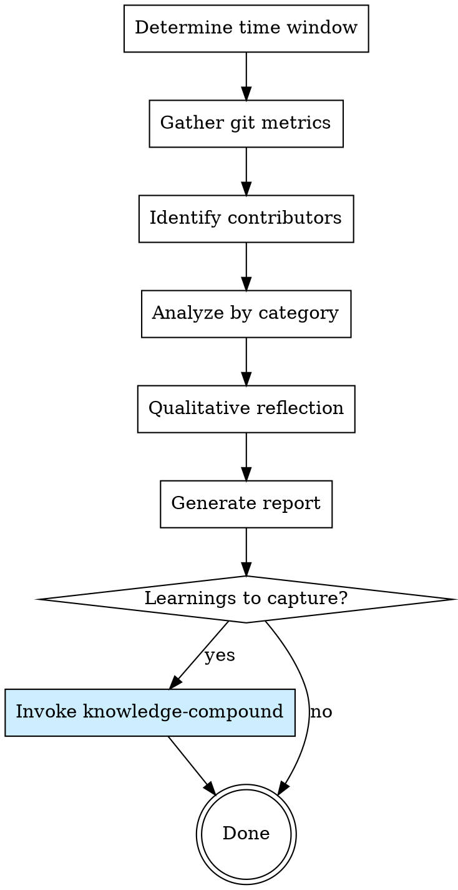

# Engineering Retrospective

Quantitative git analysis + qualitative reflection to understand what was accomplished, what went well, and what to improve. Produces a structured retro report and triggers knowledge capture.

**Origin:** Patterns extracted from gstack `/retro` (time-windowed git analysis, per-contributor attribution, midnight-aligned boundaries) with knowledge-compound integration.

## When to Use

**User-invoked** (`/engineering-retro`; fallback `/engineering-workflow:engineering-retro`) — the model suggests it but cannot self-invoke. Occasions to suggest it:

- Weekly engineering review (Friday or Monday)
- End of a sprint or project milestone
- When the user asks "what did we accomplish?" or "how did this week go?"
- After a major release to reflect on the development process
- When onboarding someone to understand recent project history

## Process Flow



## Step 1: Determine Time Window

| Window | Command | Use when |
|--------|---------|----------|
| Last 7 days (default) | `--since="7 days ago"` | Weekly retro |
| Last 14 days | `--since="14 days ago"` | Bi-weekly sprint |
| Last 30 days | `--since="30 days ago"` | Monthly review |
| Custom | `--since="YYYY-MM-DD"` | Milestone retro |

If the user doesn't specify, default to **7 days**.

### Midnight Alignment

Use midnight-aligned boundaries for accurate date windowing:

```bash
# Get the start of today in local time
TODAY_START=$(date -d "today 00:00:00" +%Y-%m-%dT00:00:00 2>/dev/null || date -v0H -v0M -v0S +%Y-%m-%dT00:00:00 2>/dev/null || date +%Y-%m-%dT00:00:00)

# 7 days ago at midnight
WINDOW_START=$(date -d "7 days ago 00:00:00" +%Y-%m-%dT00:00:00 2>/dev/null || date -v-7d -v0H -v0M -v0S +%Y-%m-%dT00:00:00 2>/dev/null || echo "7 days ago")

echo "Window: $WINDOW_START to $TODAY_START"
```

## Step 2: Gather Git Metrics

### Commit Activity

```bash
# Total commits in window
git log --since="$WINDOW_START" --oneline | wc -l

# Commits per day
git log --since="$WINDOW_START" --format="%ad" --date=short | sort | uniq -c | sort -rn

# Commit authors
git log --since="$WINDOW_START" --format="%aN" | sort | uniq -c | sort -rn
```

### Code Volume

```bash
# Lines added/removed in window
git log --since="$WINDOW_START" --shortstat --format="" | awk '
    /files? changed/ {
        files += $1
        if ($4 ~ /insertion/) { added += $4 }
        if ($4 ~ /deletion/) { removed += $4 }
        if ($6 ~ /deletion/) { removed += $6 }
    }
    END { printf "Files changed: %d\nLines added: %d\nLines removed: %d\nNet: %d\n", files, added, removed, added-removed }
'
```

### Branch Activity

```bash
# Merged branches in window
git log --since="$WINDOW_START" --merges --oneline

# Currently open branches
git branch --no-merged origin/main 2>/dev/null | head -10
```

## Step 3: Identify Contributors

Determine who contributed in this window:

```bash
# Current user
git config user.name
git config user.email

# All contributors in window
git log --since="$WINDOW_START" --format="%aN <%aE>" | sort -u
```

Orient the report around **"you" (the current git user)** vs **teammates**. If solo project, skip the per-person breakdown.

**Solo-mode flag:** if exactly one contributor in the window, set `solo_mode=true` and adjust downstream rendering:
- Skip the "Per-Contributor" section in the report **entirely** — do not render an empty table.
- In "What Went Well / Could Improve", frame observations in terms of work patterns ("you worked across N consecutive days") rather than coordination metrics.

## Step 4: Analyze by Category

Categorize commits by type. Use conventional commit prefixes if available, otherwise infer from commit messages and changed files.

### Auto-categorization

| Category | Detection |
|----------|----------|
| **Features** | `feat:` prefix, or new files in `src/`, new routes/endpoints |
| **Bug Fixes** | `fix:` prefix, or "fix", "bug", "patch" in message |
| **Tests** | `test:` prefix, or changes in `test/`, `spec/`, `__tests__/` |
| **Refactoring** | `refactor:` prefix, or "refactor", "rename", "move" in message |
| **Documentation** | `docs:` prefix, or changes in `docs/`, `*.md` files |
| **Infrastructure** | `chore:`, `ci:`, or changes in CI config, Dockerfile, deployment |
| **Dependencies** | Changes to lock files, `package.json`, `Gemfile`, `requirements.txt` |

### Health Indicators

Calculate these ratios from the commit data:

| Indicator | Formula | Healthy Range |
|-----------|---------|--------------|
| **Test ratio** | test commits / total commits | > 20% |
| **Feature velocity** | feature commits / window days | project-dependent |
| **Bug rate** | bug fix commits / total commits | < 30% (lower is better) |
| **Churn rate** | lines removed / lines added | 0.3-0.7 (balanced) |

## Step 4.5: Compare Against Prior Retros and Learnings

Before generating qualitative analysis, check for prior context.

**Source for prior knowledge:** Follow `learnings-protocol.md` READ phase. Additionally enumerate learnings created in the current retro window (regardless of relevance) for the "Knowledge compounded this period" section — retros track knowledge output, not just code output.

**Other prior context:**
1. Prior retro reports — search for `Engineering Retro:` heading in `docs/` or project docs
2. Prior retro action items — if a previous retro recommended specific improvements, check if the metrics show improvement

### Baseline Mode (first-ever retro for a project)

If no prior retro reports exist (search `docs/superpowers/retros/` and `docs/`), this is a **baseline retro**. Behavior changes:

- The report header explicitly declares "Baseline retro — establishing initial metrics".
- Lists 5-7 baseline indicators with current values AND target/alert thresholds:
  - Test ratio
  - Bug rate
  - Churn rate
  - Learnings produced (per phase or per period)
  - structured-review P1s found per phase (if applicable)
  - plan-review diff size (if applicable)
  - Any project-specific indicator the user requests
- The "Activity by Day" and "Breakdown by Category" sections render normally.
- The "What Went Well / Could Improve" sections may include observations but **must not contain comparison language** ("improved", "regressed", "better than last week"). There is no prior data to compare to.
- The "Action Items" section is permitted but should focus on **establishing measurement habits**, not improving against unknowns.

Baseline mode is one-shot — the next retro automatically exits baseline and starts comparing against this report's numbers. Detection is automatic via the search above — once this retro is saved, future runs will find it and skip baseline mode.

**How prior knowledge affects the retro:**

- **Prior retro had action items** → report whether metrics improved or worsened in the relevant area. Example: "Last retro flagged test ratio at 8%. This week: 22% — improvement confirmed."
- **Recurring bug patterns in learnings** → correlate with bug rate. If the same category (e.g., `race-condition`) appears in both learnings and this period's fixes, flag as a systemic issue.
- **Knowledge/Decision learnings created this period** → include them as "Knowledge compounded this period" in the report. This makes the retro track not just code output but knowledge output.
- **No prior retros or learnings** → note "First retro for this project" and establish baseline metrics.

## Step 5: Qualitative Reflection

After gathering quantitative data, provide qualitative analysis:

### What Went Well

Look for positive signals in the data:
- High feature velocity with low bug rate
- Good test ratio
- Consistent daily commit activity (not all bunched on one day)
- Successful merges without conflicts
- Code cleanup (healthy churn rate)

### What Could Improve

Look for warning signals:
- Bug rate > 30% — quality issues
- Test ratio < 10% — under-testing
- All commits on one day — batching suggests blockers earlier in the week
- High churn with low net change — rework
- Many open unmerged branches — WIP accumulation

### Growth Opportunities

Based on the patterns observed, suggest concrete next actions:
- If bug rate is high → "Consider adding `security-audit` to the pre-merge workflow"
- If test ratio is low → "Leverage `superpowers:test-driven-development` more consistently"
- If rework is high → "Use `plan-review-personas` to catch issues before implementation"

## Step 6: Generate Report

```markdown
## Engineering Retro: <start date> — <end date>

### Quantitative Summary

| Metric | Value |
|--------|-------|
| Commits | <N> |
| Files changed | <N> |
| Lines added | <N> |
| Lines removed | <N> |
| Net change | <N> |
| Contributors | <N> |
| Merged branches | <N> |

### Activity by Day

<bar chart or table showing commits per day>

### Breakdown by Category

| Category | Commits | % |
|----------|---------|---|
| Features | <N> | <N>% |
| Bug Fixes | <N> | <N>% |
| Tests | <N> | <N>% |
| Refactoring | <N> | <N>% |
| Docs | <N> | <N>% |
| Infra | <N> | <N>% |

### Health Indicators

| Indicator | Value | Assessment |
|-----------|-------|-----------|
| Test ratio | <N>% | ✓ Healthy / ⚠ Low / ✗ Missing |
| Bug rate | <N>% | ✓ Low / ⚠ Moderate / ✗ High |
| Churn rate | <N> | ✓ Balanced / ⚠ High rework |

### Per-Contributor (omit entirely when solo_mode=true)

If multiple contributors:

| Contributor | Commits | Added | Removed | Focus Areas |
|-------------|---------|-------|---------|-------------|
| <name> | <N> | <N> | <N> | features, tests |

If solo_mode=true: skip this section. Do not render an empty table.

### Highlights

<top 3-5 notable accomplishments with commit references>

### What Went Well

<qualitative analysis>

### What Could Improve

<warning signals and suggestions>

### Action Items

<concrete next steps, linked to available skills>

### Baseline Established (only when in baseline mode)

| Indicator | Current value | Target / Alert |
|---|---|---|
| Test ratio | <N>% | Hold ≥20%; alert if <15% |
| Bug rate | <N>% | Hold <20%; alert if >30% |
| Churn rate | <N> | Track; alert if outside 0.3-0.7 sustained |
| Learnings per phase | <N> | Track; flat or rising = healthy reflection |
| structured-review P1s per phase | <N> | Track; goal is downward over time |
| Active-day concentration | <N> days for <M> commits | Track; sustained bursts → review process load |
| <Custom indicator> | <value> | <threshold> |
```

## Step 7: Knowledge Capture

After presenting the report, ask:

> "Were there any learnings from this period that should be documented for future reference? (debugging insights, architectural decisions, patterns discovered)"

If yes, invoke `knowledge-compound` to capture them.

If the retro revealed recurring issues (same bug type appearing multiple times, repeated rework in the same area), specifically suggest documenting those as **Pitfall** learnings.

## Red Flags — STOP

| Thought | Reality |
|---------|---------|
| "Nothing interesting happened this week" | The data tells the story. Even quiet weeks have patterns worth noting. |
| "Retros are a waste of time" | Unexamined work repeats its mistakes. 10 minutes of reflection saves hours of rework. |
| "The numbers speak for themselves" | Numbers without context mislead. Always pair metrics with qualitative analysis. |
| "We should compare to other teams" | Compare to your own history, not others. Context differs too much for cross-team comparisons. |

## Integration with Superpowers

- **Triggers:** user-invoked (`/engineering-retro`); suggested on weekly cadence, project milestones, or user request
- **Output feeds:** `knowledge-compound` for learnings capture
- **References:** All custom skills — the retro report suggests which skills could address identified issues
- **Complements:** `persona` memory — retro insights about the user's work patterns can inform persona preferences
