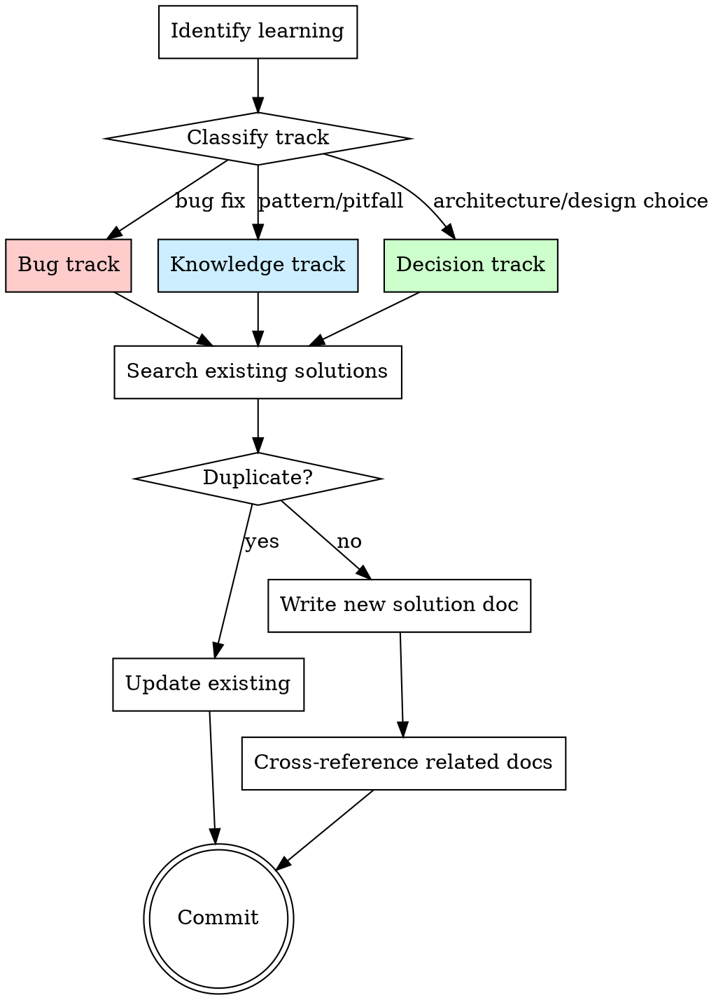

# Knowledge Compound

Document solved problems, engineering decisions, and patterns as reusable knowledge. Each documented solution makes future similar problems faster to solve.

**Origin:** Patterns extracted from compound-engineering (track-aware templates, cross-referencing, refresh cycles) and gstack (operational learnings, JSONL persistence).

**Core principle:** Knowledge that stays in a conversation is lost. Knowledge that's written down compounds.

## Protocol Compliance

This skill implements the **WRITE phase** of `skills/using-engineering-workflow/references/learnings-protocol.md`. The frontmatter, cross-reference, and synthesis rules below derive from the protocol; if they diverge, the protocol wins.

## The Iron Law

```
NO SESSION ENDS WITHOUT OFFERING TO COMPOUND LEARNINGS
```

Before closing out a development session that involved problem-solving, debugging, decision-making, or pattern discovery, you MUST ask whether findings should be documented.

## When to Use

- After fixing a non-trivial bug (the root cause + fix is a learning)
- After making an architectural or design decision (the reasoning is a learning)
- After discovering a project-specific pattern or pitfall (the pattern is a learning)
- After a debugging session that took more than one attempt (what misled you is a learning)
- When the user explicitly asks to document knowledge
- Before ending any development session (offer to compound)

## Process Flow



## Step 1: Identify Learnings

Review the current session for compoundable knowledge. Look for:

- **Root causes** that were not obvious from the symptoms
- **Decisions** where multiple valid options existed and reasoning drove the choice
- **Patterns** that worked well and should be repeated
- **Pitfalls** that caused wasted time and should be avoided
- **Surprises** where the system behaved unexpectedly

**If nothing compoundable was learned:** Say so and stop. Not every session produces learnings. Fabricating learnings to fill a template is worse than documenting nothing.

## Step 2: Classify Track

Each learning falls into one of three tracks. The track determines the template structure.

| Track | When | Key sections |
|-------|------|-------------|
| **Bug** | A bug was found and fixed | Symptoms, What Didn't Work, Root Cause, Fix, Prevention |
| **Knowledge** | A pattern, pitfall, or technique was discovered | Context, Guidance, When to Apply, Examples |
| **Decision** | An architectural or design choice was made | Context, Options Considered, Decision, Rationale, Trade-offs |

## Step 3: Search Existing Solutions (MANDATORY)

**This step is not optional.** Before writing anything, you MUST search for existing knowledge to avoid duplication and enable cross-referencing.

### 3a: Search project learnings

```bash
# List all existing learnings
find docs/learnings -name "*.md" 2>/dev/null | head -30
```

Then use the native content-search tool (Grep) to search for keywords related to the learning across multiple locations:

```
Search targets (in order):
  1. docs/learnings/       — prior compound learnings
  2. docs/solutions/       — if CE-style solutions exist
  3. docs/plans/           — prior plans that may contain relevant decisions
  4. docs/brainstorms/     — prior brainstorms with context
  5. CLAUDE.md / AGENTS.md — project conventions
```

### 3b: Search system memory

Check if the `persona` memory system has relevant cross-project knowledge:

- If MEMORY.md exists at the project memory path, scan it for related entries
- Cross-project patterns are especially valuable — a pitfall learned in project A may prevent a bug in project B

### 3c: Decide action

| Search result | Action |
|---------------|--------|
| **Exact match found** (same root cause, same fix) | **Do not create duplicate.** Tell the user the learning already exists at `<path>`. |
| **Related document found** (same area, different aspect) | **Create new document** with `## Related` cross-reference to the existing one. Update the existing doc's Related section too. |
| **Contradicting document found** (new learning invalidates an old one) | **Update the old document**: mark it as `Status: Superseded by [new doc]`. Create the new doc with a note explaining why the old approach was wrong. |
| **Nothing found** | Create new document normally. |

**If a related document exists:**
- Read it
- Determine if this is an **update** (new information on the same topic) or a **new learning** (different aspect of the same area)
- If update: modify the existing document, add a `## Updated YYYY-MM-DD` section
- If new: create a new document and add a cross-reference

## Step 4: Write Solution Document

Create the document at `docs/learnings/YYYY-MM-DD-<topic-slug>.md`.

If the `docs/learnings/` directory doesn't exist, create it.

### Bug Track Template

```markdown
---
track: bug
status: active
category: <race-condition | auth | data-integrity | omit>
last-verified: <YYYY-MM-DD>
---
# <Title: What was broken>

**Track:** Bug
**Date:** YYYY-MM-DD
**Severity:** P0/P1/P2/P3
**Time to resolve:** <approximate>

## Symptoms

What was observed. Error messages, unexpected behavior, failing tests.

## What Didn't Work

Approaches that were tried and failed, and why they failed.
This is the most valuable section — it prevents future you from repeating mistakes.

## Root Cause

The actual underlying issue. Be specific — file paths, line numbers, the exact
mechanism that caused the failure.

## Fix

What was changed and why this fix is correct (not just "it works now").

## Prevention

How to prevent this class of bug in the future. Test additions,
lint rules, architectural changes.

## Related

- Links to related learnings, issues, or documentation
```

### Knowledge Track Template

```markdown
---
track: knowledge
status: active
category: <pattern | pitfall | testing | omit>
last-verified: <YYYY-MM-DD>
---
# <Title: Pattern or technique name>

**Track:** Knowledge
**Date:** YYYY-MM-DD
**Applies to:** <language, framework, domain, or "general">

## Context

When does this pattern apply? What problem does it solve?

## Guidance

The pattern itself. Concrete, actionable, with code examples where appropriate.

## When to Apply

Specific triggers that should make you think of this pattern.

## When NOT to Apply

Situations where this pattern would be wrong or counterproductive.

## Examples

Real examples from this codebase (with file paths) where this pattern
was applied or should be applied.

## Related

- Links to related learnings or external references
```

### Decision Track Template

```markdown
---
track: decision
status: active
category: <architecture | trade-off | api-design | omit>
last-verified: <YYYY-MM-DD>
---
# <Title: Decision that was made>

**Track:** Decision
**Date:** YYYY-MM-DD
**Status:** Active | Superseded by [link]
**Participants:** <who was involved in the decision>

## Context

What situation prompted this decision? What constraints existed?

## Options Considered

### Option A: <name>
- Pros: ...
- Cons: ...

### Option B: <name>
- Pros: ...
- Cons: ...

## Decision

Which option was chosen.

## Rationale

WHY this option was chosen. This is the most important section.
Future you needs to understand the reasoning, not just the conclusion.

## Trade-offs Accepted

What downsides were knowingly accepted with this decision.

## Revisit When

Conditions under which this decision should be re-evaluated.

## Related

- Links to related decisions, learnings, or documentation
```

## Step 5: Cross-Reference

After writing the document:

1. Search for related existing learnings
2. Add `## Related` links in both directions (new doc → existing, existing → new)
3. If the learning affects project conventions, note whether CLAUDE.md or AGENTS.md should be updated
4. **Supersedence:** if this new learning replaces an older one, edit the older doc's frontmatter to `status: superseded` and add `superseded-by: <this-new-file's-relative-path>`. The `Related:` link to the new doc remains for backwards traceability.

## Step 6: Commit

Commit the learning document with a descriptive message:

```
docs: compound learning — <brief description>
```

## Frontmatter Field Guide

Required by `learnings-protocol.md` WRITE phase. Always emit `track` (matching the template used) and `status` (`active` for new docs). Set `last-verified` to today's date. Set `category` only when it maps cleanly to one in `references/categories.md` — uncategorized is fine. Set `superseded-by` only together with `status: superseded` (relative path to the superseding doc); never alone.

**Read-side tolerance:** existing learnings without frontmatter remain valid. Parsers apply defaults: `track=knowledge`, `status=active`, `last-verified=git-creation-date`.

## Refresh Cycle

Learnings can become stale as the codebase evolves. Periodically (monthly or at project milestones), review existing learnings:

| Action | When |
|--------|------|
| **Keep** | Still accurate and relevant |
| **Update** | Core insight is right but details have changed |
| **Replace** | A better approach was found; write new doc, mark old as superseded |
| **Archive** | No longer relevant (move to `docs/learnings/archive/`) |

To trigger a refresh:
> "Let's review our learnings" or "refresh compound knowledge"

## Red Flags — STOP

| Thought | Reality |
|---------|---------|
| "This is obvious, no need to document" | Obvious to you NOW. Not obvious to future you or teammates. |
| "I'll remember this" | You won't. The next session starts with a blank context. |
| "The fix is in the code, that's enough" | Code shows WHAT, not WHY. The reasoning is the learning. |
| "Too busy to document" | 5 minutes of documentation saves hours of rediscovery. |
| "This is too specific to this project" | Project-specific learnings are the MOST valuable. General knowledge is already in training data. |

## Integration with Superpowers

- **After `superpowers:systematic-debugging`:** If root cause was non-obvious, compound it (Bug track)
- **After `superpowers:finishing-a-development-branch`:** Offer to compound before closing
- **After `structured-review`:** If review uncovered a pattern, compound it (Knowledge track)
- **With `persona` memory system:** Persona stores user preferences; compound stores engineering knowledge. They are complementary, not overlapping.

## Storage Locations

| Scope | Path | Purpose |
|-------|------|---------|
| Project-specific | `docs/learnings/*.md` | Committed to repo, shared with team |
| Personal notes | System memory (MEMORY.md) | Cross-project preferences (via persona) |
