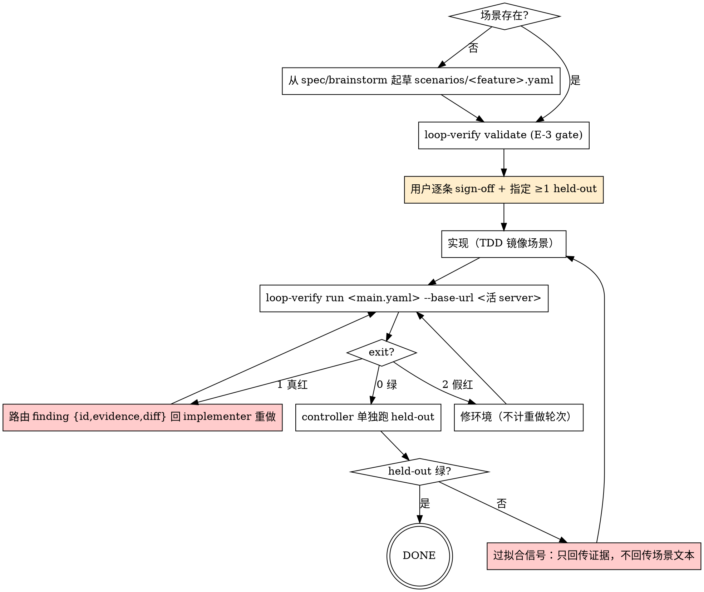

# Loop Verify — 验收回路驱动器

会话侧的回路协议（scenario-protocol v0.1 的 orchestration 层）：契约管规则、`loop-verify` CLI 管机械观察，本 skill 管**循环怎么转**。经 enterprice_agent 两段试点（Stage A 管线 / Stage B spec-first 全环）验证后固化。

**Origin:** `references/scenario-protocol.md`（契约，权威）+ loop-engine 试点报告（Stage A/B, 2026-07-16）。

## When to Use

- 已采纳协议的项目里，T2 且有 HTTP 观察面的工作项——**实现前**（起草+签核场景）与**声称完成前**（跑绿裁决）各一次
- 用户说"跑验收"、"run acceptance"、"verify scenarios"、"场景验收"

## When NOT to Use

- 未采纳协议的项目（conservative-wins：不采纳不受约束）
- 代码质量审查 → `structured-review`；单元测试 → 直接跑测试套件
- 纯文档/无 HTTP 面的工作项（协议豁免，floor #2 的其他形态适用）

## Prerequisites（第一步就查，缺了先修环境）

```bash
loop-verify --version                 # 引擎（pip install -e <loop-engine>）
hurl --version                        # 传感器（winget install Orange-OpenSource.Hurl）
grep -q "scenario-protocol" CLAUDE.md # 项目已采纳
```

- console script 不在 PATH 时（Windows editable 安装常见），等价调用：`python -m loop_verify.cli ...` ——下文所有 `loop-verify` 命令同理替换。
- 目标 server 地址：默认读场景文件 `base_url_env` 声明的环境变量；`--base-url` 是显式覆盖（契约以 env var 为准，flag 为引擎便利项）。

## The Loop



**回路规则（契约 normative，此处执行）：**

1. **Sign-off 是硬 gate**：未经用户逐条确认的场景不是 oracle，不得据此实现或声称完成。确认记录进 feature spec。
2. **重做上限 2 轮**：同一场景连败两轮且修法不同 → 升级人工（场景歧义或架构撑不住），不许无限空转。
3. **exit 2 支配 exit 1**：观察不可靠的运行不是实现裁决；修环境不消耗重做轮次。
4. **held-out 隔离**：implementer（含 subagent）绝不读 `scenarios/held-out/`；只有 controller 在主套件全绿后跑它。失败时只回传证据（evidence/diff），不回传场景文本。
5. **回归**：同项目已有其他 feature 的场景文件时，完成前一并重跑（试点先例：A4b 完成时回归 A4a）。

## Red Flags — STOP

| 念头 | 现实 |
|---|---|
| "场景写错了，我改一下让它过" | Oracle 篡改（E-3）。改场景必须回到用户重新确认。 |
| "held-out 红了，看一眼场景内容找原因" | 看了就废了防过拟合。只看证据。 |
| "场景很显然，跳过 sign-off" | 无 sign-off = 无 oracle = 不 gate。 |
| "server 连不上，算一轮失败重做" | exit 2 是环境问题，修环境，不计轮。 |
| "主套件绿了就算完成" | held-out 绿才是 done。 |

## Integration

- **前置**：`superpowers:brainstorming` / spec 产出场景素材；`grill-me` 可在 sign-off 前拷问场景完备性
- **正交**：`structured-review` 管代码质量；本 skill 管业务验收——两者都过才 ship
- **证据**：`superpowers:verification-before-completion` 的证据 = 引擎裁决 JSON（`--report`）
- **发布**：`ship-and-pr` 时把 verdict 报告路径附进 PR 正文
- **知识**：回路揪出契约-实现偏差时 → `knowledge-compound`（Bug/Decision track）
