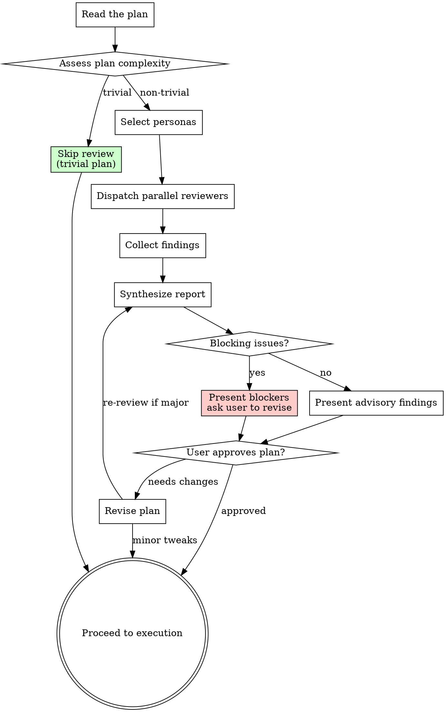

# Plan Review Personas

Stress-test implementation plans through three adversarial persona agents before committing to execution. Catches scope creep, infeasible approaches, and unstated assumptions that survive brainstorming but break during implementation.

**Origin:** Patterns extracted from compound-engineering (document-review personas: feasibility, scope-guardian, adversarial) and gstack (CEO + eng + design multi-role plan review).

## The Iron Law

```
NO PLAN EXECUTION WITHOUT AT LEAST ONE ADVERSARIAL REVIEW
```

A plan that has only been reviewed by the person who wrote it is not reviewed. Plans need adversarial pressure — someone whose job is to find the holes.

## When to Use

- After `superpowers:writing-plans` produces an implementation plan
- Before `superpowers:subagent-driven-development` or `superpowers:executing-plans` begins
- When a plan feels "too clean" or was produced too quickly
- When the user asks "is this plan solid?" or "what am I missing?"

## When NOT to Use

- Trivial plans (single task, obvious implementation, < 30 minutes work)
- Plans that have already been reviewed and revised in this session
- During execution — use `superpowers:requesting-code-review` for code, not plans

## Process Flow



## Step 0: Read the Plan and Prior Knowledge

### 0a: Locate the plan

Locate the plan file. Common locations:
- Path specified by the user
- Most recent file in `docs/plans/` or `docs/superpowers/plans/`
- Plan written earlier in this session

Read the full plan. If the plan cannot be found, ask the user for the path.

### 0b: Lookup Prior Knowledge

Follow `learnings-protocol.md` READ phase. Filter to Decision-track and pattern-category learnings relevant to the plan's scope. Prior plans in `docs/plans/` or `docs/superpowers/plans/` are also worth scanning for "we tried this before" context.

## Step 1: Assess Complexity

| Complexity | Criteria | Action |
|------------|----------|--------|
| **Trivial** | Single task, one file, obvious implementation | Skip review — say "This plan is straightforward, proceeding to execution." |
| **Standard** | 3-10 tasks, known patterns, bounded scope | Run **feasibility** + **scope-guardian** |
| **Complex** | 10+ tasks, new patterns, cross-cutting concerns, unclear boundaries | Run all three: **feasibility** + **scope-guardian** + **adversarial** |

## Step 2: Select and Dispatch Personas

Dispatch selected personas **in parallel** using the Agent tool. Each persona gets:

1. The full plan text
2. Their specific reviewer prompt from `reviewers/<name>.md`
3. Relevant project context (CLAUDE.md, AGENTS.md if they exist)

```
For each selected persona:
  Spawn Agent with:
    - name: "plan-review-<persona_name>"
    - prompt: contents of reviewers/<name>.md + the plan
    - model: use the most capable available model (review is judgment work)
```

### The Three Personas

| Persona | File | Focus |
|---------|------|-------|
| **Feasibility Reviewer** | `reviewers/feasibility.md` | Will this approach actually work? Technical reality check. |
| **Scope Guardian** | `reviewers/scope-guardian.md` | Is this plan doing too much? Premature abstractions? |
| **Adversarial Reviewer** | `reviewers/adversarial.md` | What assumptions are wrong? What failure modes are ignored? |

## Step 3: Collect and Synthesize

After all personas return, synthesize findings into a unified report.

### Finding Severity

| Level | Meaning | Action |
|-------|---------|--------|
| **Blocker** | Plan will fail or produce wrong results if executed as-is | Must revise before execution |
| **Warning** | Significant risk that should be addressed or consciously accepted | Recommend revision |
| **Advisory** | Observation that improves the plan but is not critical | User's discretion |

### Deduplication

If two personas flag the same issue, merge into a single finding with the higher severity. Note both perspectives in the evidence.

### Disagreements

If personas contradict each other (one says "this is fine", another says "this will fail"):
- Present both positions with their reasoning
- **Do not resolve the disagreement yourself** — present it to the user
- The user has context that neither persona has

## Step 4: Present Report

```markdown
## Plan Review Report

**Plan:** <plan title or file path>
**Personas run:** feasibility, scope-guardian, adversarial
**Review round:** <1 (first review) | RETHINK 1/2 | RETHINK 2/2 — LIMIT REACHED>
**Verdict:** APPROVE / REVISE / RETHINK

### Blockers
<list or "None — plan is execution-ready">

### Warnings
<list with persona attribution>

### Advisory
<observations and suggestions>

### Persona Disagreements (if any)
<both sides presented>

### Recommended Revisions
<specific, actionable changes to the plan>
```

**Verdict rules:**
- Any blocker → **RETHINK** (fundamental issue) or **REVISE** (fixable issue)
- Only warnings → **REVISE** (recommended) or **APPROVE** (if user accepts risks)
- Only advisory → **APPROVE**

## Step 5: Iterate or Proceed

### Retry Limit

Track the review round number visibly in the report header:

```
**Review round:** RETHINK 1/2
```

**Hard cap: 2 consecutive RETHINK verdicts.** If the same plan reaches RETHINK twice:

```
⛔ RETHINK limit reached (2/2).
This plan has fundamental issues that two review rounds could not resolve.
Automated iteration stops here. Next steps require human judgment:
  - Revisit the original requirement — is the scope realistic?
  - Break the plan into smaller independent deliverables
  - Discuss the blocker findings with a teammate
```

**STOP. Do not loop back to brainstorming or writing-plans a third time.** The plan needs human thinking, not more agent cycles.

**Round counting rules:**
- A REVISE that is subsequently re-reviewed does NOT increment the RETHINK counter (REVISE = fixable, not fundamental)
- Only consecutive RETHINK verdicts count toward the limit
- A REVISE verdict between two RETHINKs resets the counter to 0

### Proceed logic

**If APPROVE:** Transition to execution. Invoke `superpowers:subagent-driven-development` or `superpowers:executing-plans`.

**If REVISE:** Help the user update the plan. For minor revisions, proceed after changes without re-review. For major revisions (new tasks, changed architecture), re-run the relevant persona(s).

**If RETHINK (round 1/2):** The plan has a fundamental flaw. Return to `superpowers:brainstorming` or `superpowers:writing-plans` to redesign the affected section. Mark the round clearly.

**If RETHINK (round 2/2):** STOP. See retry limit above.

## Red Flags — STOP

| Thought | Reality |
|---------|---------|
| "The plan looks complete, skip review" | Completeness ≠ correctness. Review catches what planning misses. |
| "We already brainstormed this" | Brainstorming validates WHAT. Plan review validates HOW. |
| "Review will slow us down" | Rework from a bad plan costs 10x more than a 5-minute review. |
| "I wrote the plan, I know it's good" | Author blindness is real. Adversarial review exists for this reason. |
| "It's just a small plan" | Check the complexity assessment. If it's truly trivial, skip is automatic. |

## Step 6: Knowledge Output

If the review surfaced reusable insights:

- **Plan had a fundamental flaw that was caught** → suggest compounding as a Pitfall learning (so future plans avoid this class of mistake)
- **Persona disagreement revealed a non-obvious trade-off** → suggest compounding as a Decision learning
- **A prior learning was confirmed as still relevant** → no action needed (but note it in the report)

## Integration with Superpowers

- **Before this skill:** `superpowers:writing-plans` produces the plan
- **During this skill:** Personas may reference `superpowers:test-driven-development` principles when evaluating test coverage in the plan
- **After this skill:** `superpowers:subagent-driven-development` or `superpowers:executing-plans` for execution
- **Knowledge capture:** If the review surfaces a reusable insight, invoke `knowledge-compound` after execution
