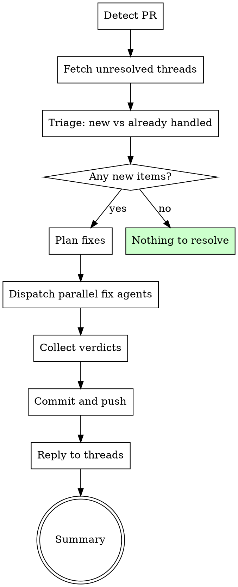

# Resolve PR Review Feedback

Evaluate PR review comments, fix valid issues in parallel, reply to threads, and push the fixes. Turns review feedback into resolved code in one workflow.

**Origin:** Patterns extracted from compound-engineering `resolve-pr-feedback` (GraphQL thread fetching, triage, parallel agent dispatch, verdict system).

> **Agent time is cheap. Tech debt is expensive.**
> Fix everything valid — including nitpicks and low-priority items. If we're already touching the code, fix it rather than defer it.

## When to Use

- After receiving code review comments on a PR
- When the user says "resolve the PR comments" or "fix the review feedback"
- After `structured-review` or human reviewers leave feedback
- Complements `superpowers:receiving-code-review` (SP manages rigor/skepticism, this skill manages execution)

## Mode Detection

| Argument | Mode |
|----------|------|
| No argument | **Full** — all unresolved threads on the current branch's PR |
| PR number (e.g., `123`) | **Full** — all unresolved threads on that PR |
| Comment/thread URL | **Targeted** — only that specific thread |

## Process Flow



## Step 1: Detect PR

If no PR number provided, detect from current branch:

```bash
gh pr view --json number,url -q '"\(.number) \(.url)"'
```

If no PR exists for this branch, STOP: "No PR found for this branch. Create one first with `ship-and-pr`."

## Step 2: Fetch Unresolved Threads

Fetch all review comments and threads:

```bash
# Get review threads (inline code comments)
gh api graphql -f query='
  query($owner: String!, $repo: String!, $pr: Int!) {
    repository(owner: $owner, name: $repo) {
      pullRequest(number: $pr) {
        reviewThreads(first: 100) {
          nodes {
            id
            isResolved
            isOutdated
            path
            line
            comments(first: 10) {
              nodes {
                body
                author { login }
                createdAt
              }
            }
          }
        }
      }
    }
  }
' -f owner="$(gh repo view --json owner -q .owner.login)" \
  -f repo="$(gh repo view --json name -q .name)" \
  -F pr="$(gh pr view --json number -q .number)"
```

```bash
# Get top-level PR comments
gh api "repos/$(gh repo view --json nameWithOwner -q .nameWithOwner)/pulls/$(gh pr view --json number -q .number)/comments"
```

Filter to: **unresolved** and **not outdated** threads only.

## Step 3: Triage

Classify each feedback item:

| Status | Criteria | Action |
|--------|----------|--------|
| **New** | No substantive reply from PR author | Process |
| **Pending decision** | Author replied but deferred ("need to think about this") | Skip — don't re-process |
| **Already handled** | Author replied with fix or explanation | Skip |
| **Not actionable** | Bot boilerplate, approval comments, CI summaries | Drop |

If all items are already handled or not actionable: "All feedback resolved or not actionable. Nothing to do." → STOP.

## Step 4: Plan

Create a task list of new items, grouped by type:

| Type | Examples |
|------|---------|
| **Code fix** | "This should validate input", "Missing null check" |
| **Question** | "Why did you choose this approach?" |
| **Style/convention** | "Use camelCase here", "Add JSDoc" |
| **Test** | "Add a test for the edge case" |
| **Won't fix** | Feedback that is factually incorrect about the code |

## Step 5: Dispatch Parallel Fix Agents

For each new item, spawn an Agent to handle it:

```
For each new feedback item:
  Spawn Agent with:
    - name: "fix-feedback-<thread_id>"
    - prompt: "Fix this PR review comment. File: <path>, Line: <line>.
              Comment: <body>. Read the file, understand the context,
              make the fix (or explain why not). Return a verdict."
    - mode: make the necessary code changes
```

**Conflict avoidance:** If two comments touch the same file, dispatch them sequentially (not parallel) to avoid merge conflicts.

**Batching:** 1-4 items → all parallel. 5+ items → batches of 4.

### Verdict System

Each agent returns one verdict:

| Verdict | Meaning |
|---------|---------|
| `fixed` | Code change made as requested |
| `fixed-differently` | Code changed, but with a better approach than suggested |
| `replied` | No code change — answered a question or explained a design decision |
| `not-addressing` | Feedback is factually wrong about the code; skip with evidence |
| `needs-human` | Cannot determine the right action; needs user decision |

## Step 6: Commit and Push

If any agents made code changes:

```bash
# Stage changed files
git add <files reported by agents>

# Commit referencing the PR
git commit -m "fix: address PR review feedback (#<PR_NUMBER>)"

# Push
git push
```

If all verdicts are `replied`, `not-addressing`, or `needs-human` (no code changes), skip commit/push.

## Step 7: Reply to Threads

For each resolved item, post a reply to the thread:

```bash
# For inline review threads (can resolve via GraphQL)
gh api graphql -f query='
  mutation($threadId: ID!) {
    resolveReviewThread(input: {threadId: $threadId}) {
      thread { isResolved }
    }
  }
' -f threadId="<thread_id>"
```

For non-resolvable comments (top-level PR comments), post a reply:

```bash
gh pr comment <PR_NUMBER> --body "<reply_text>"
```

**Reply content per verdict:**
- `fixed`: "Fixed in <commit_sha>. <brief description of change>"
- `fixed-differently`: "Addressed differently — <explanation>. See <commit_sha>"
- `replied`: "<answer to the question or explanation>"
- `not-addressing`: "Not addressing — <evidence why the feedback doesn't apply>"
- `needs-human`: *(don't auto-reply — present to user)*

## Step 8: Summary

```markdown
## PR Feedback Resolution

**PR:** #<number>
**Threads processed:** <N>
**Skipped (already handled/not actionable):** <N>

| Thread | File | Verdict | Detail |
|--------|------|---------|--------|
| #1 | src/auth.ts:42 | fixed | Added input validation |
| #2 | src/api.ts:15 | replied | Explained design decision |
| #3 | — | not-addressing | Bot boilerplate |

### Needs Human Decision
<list of needs-human items, if any>

### Summary
Fixed: <N> | Replied: <N> | Not addressing: <N> | Needs human: <N>
```

## Red Flags — STOP

| Thought | Reality |
|---------|---------|
| "It's just a nitpick, skip it" | Nitpicks are cheap to fix now, expensive to accumulate. Fix them. |
| "The reviewer is wrong" | Use `not-addressing` with evidence, not silent dismissal. |
| "I'll fix it later" | You are here now. The code is open. Fix it. |
| "Just approve and move on" | Review feedback exists for a reason. Addressing it builds trust. |

## Integration with Superpowers

- **Before this skill:** `superpowers:receiving-code-review` ensures you evaluate feedback with rigor, not blind agreement
- **After this skill:** Re-run `structured-review` if fixes were substantial, or `ship-and-pr` to update the PR
- **Knowledge output:** If feedback revealed a recurring pattern, invoke `knowledge-compound` (Knowledge track)
