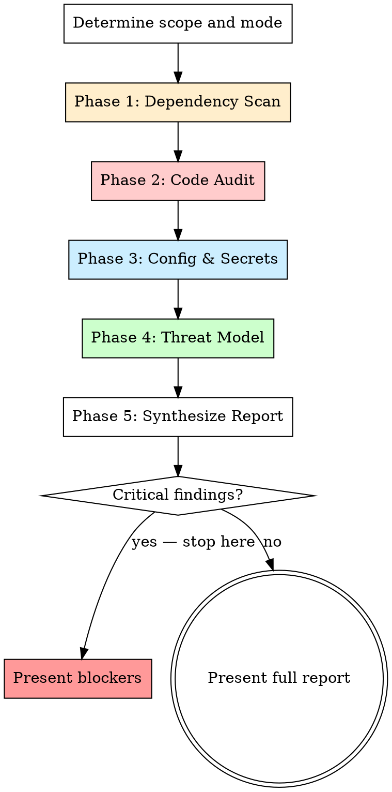

# Security Audit

Phased security audit that combines OWASP Top 10 vulnerability scanning with STRIDE threat modeling. Produces actionable findings with confidence gates to minimize noise.

**Origin:** Patterns extracted from gstack `/cso` (phased audit structure, confidence gates, OWASP + STRIDE) and compound-engineering security-reviewer (attack path tracing, lower confidence threshold for security).

## The Iron Law

```
NO RELEASE WITHOUT SECURITY REVIEW ON CHANGED ATTACK SURFACE
```

If the diff touches authentication, authorization, user input handling, API endpoints, secrets management, or data storage — a security audit is mandatory, not optional.

## When to Use

**Always before:**
- Major releases or version bumps
- Changes to auth/authz flows
- New API endpoints or modified existing ones
- Changes to data models that store PII or credentials
- Infrastructure or deployment configuration changes

**Also when:**
- The user explicitly asks for a security review
- `structured-review` security reviewer flagged concerns that need deeper analysis
- A dependency update includes security advisories
- Post-incident, to verify the fix and find related vulnerabilities

**Do NOT use for:**
- Pure UI/CSS changes with no data handling
- Documentation-only changes
- Test-only changes (unless testing security features)

## Audit Modes

| Mode | Scope | Confidence Gate | When |
|------|-------|----------------|------|
| **Focused** | Only changed files + their direct callers | 0.70 | Default — triggered by diff |
| **Comprehensive** | Full codebase scan of security-sensitive areas | 0.50 | Before major releases, or user requests "full audit" |

## Process Flow



## Phase 0: Determine Scope

### Focused Mode (default)

```bash
# Get changed files
BASE=$(git merge-base HEAD "origin/$(git rev-parse --abbrev-ref HEAD@{upstream} 2>/dev/null | sed 's|origin/||' || echo main)" 2>/dev/null || echo "HEAD~1")
git diff "$BASE" --name-only
```

Identify which changed files are **security-sensitive**:

| Pattern | Why |
|---------|-----|
| `*auth*`, `*login*`, `*session*`, `*token*` | Authentication/authorization |
| `*api*`, `*route*`, `*controller*`, `*endpoint*` | API surface |
| `*model*`, `*schema*`, `*migration*` | Data models |
| `*config*`, `*.env*`, `*secret*`, `*credential*` | Configuration/secrets |
| `*upload*`, `*file*`, `*path*` | File handling |
| `*sanitiz*`, `*valid*`, `*escap*` | Input handling |
| `*crypto*`, `*encrypt*`, `*hash*`, `*sign*` | Cryptography |
| `*permission*`, `*role*`, `*policy*`, `*guard*` | Authorization |

If no changed files match security-sensitive patterns, report: "No security-sensitive changes detected in this diff. Skipping detailed audit." and stop — unless the user explicitly requested a comprehensive audit.

### Comprehensive Mode

Scan the full codebase for security-sensitive areas. Use the native file-search tool (Glob) to find files matching the patterns above, then read and audit them.

## Step 0: Lookup Prior Knowledge

Follow `learnings-protocol.md` READ phase. Filter to learnings with categories: `auth`, `race-condition`, `data-integrity`, `config-drift`, `encoding`, `migration`. Also consult `CLAUDE.md`/`AGENTS.md` for security conventions and prior security audit reports under `docs/` or `.context/`.

## Phase 1: Dependency Scan

Check for known vulnerabilities in dependencies.

### Detection by ecosystem

| Ecosystem | Check command | Vulnerability DB |
|-----------|--------------|-----------------|
| Node.js | `npm audit --json 2>/dev/null \|\| bun pm audit 2>/dev/null` | npm advisory |
| Python | `pip audit --format json 2>/dev/null \|\| safety check --json 2>/dev/null` | PyPI/OSV |
| Ruby | `bundle audit check 2>/dev/null` | RubySec |
| Go | `govulncheck ./... 2>/dev/null` | Go vuln DB |
| Rust | `cargo audit 2>/dev/null` | RustSec |

If the audit tool is not installed, note it as an advisory finding and proceed. Do not fail the audit because a tool is missing.

### Dependency findings

| Severity | Criteria |
|----------|----------|
| P0 | Known exploited vulnerability (CISA KEV), or critical CVSS 9.0+ with network vector |
| P1 | High CVSS 7.0-8.9 with plausible attack path in this application |
| P2 | Medium severity or high severity with no clear attack path |
| P3 | Low severity, informational |

## Phase 2: Code Audit (OWASP Top 10)

Audit changed code (or full security surface in comprehensive mode) against the OWASP Top 10. Reference `references/owasp-top10.md` for the full checklist.

For each category, search for vulnerability patterns using the native content-search tool (Grep):

### Key search patterns

```
# Injection (A03)
Search for: string concatenation in SQL, shell commands, LDAP queries
Patterns: "execute(", "query(", "system(", "exec(", "eval(", f-strings near SQL

# Broken Auth (A07)
Search for: hardcoded credentials, weak token generation, missing rate limiting
Patterns: "password =", "secret =", "api_key =", "Math.random()" near token

# Security Misconfiguration (A05)
Search for: debug mode in production, permissive CORS, verbose error messages
Patterns: "DEBUG = True", "Access-Control-Allow-Origin: *", stack traces in responses

# Cryptographic Failures (A02)
Search for: weak algorithms, missing encryption, plaintext storage
Patterns: "MD5", "SHA1" (non-HMAC), "DES", plaintext password storage
```

### Attack Path Tracing

For each potential vulnerability found:

```
1. ENTRY POINT — Where does untrusted data enter?
   (HTTP request, file upload, WebSocket, env var, database read)

2. DATA FLOW — How does the data travel through the system?
   (Is it validated? Transformed? Stored?)

3. DANGEROUS SINK — Where is the data used in a privileged operation?
   (SQL query, shell command, HTML render, file write, redirect)

4. PROTECTIONS — What stops the attack?
   (Parameterized query, allowlist, CSP, escaping, sandbox)

5. BYPASS — Can the protections be circumvented?
   (Encoding tricks, type coercion, race conditions)
```

Only report if you can trace from entry to sink with insufficient protection.

## Phase 3: Config & Secrets

### Secrets scan

Search for accidentally committed secrets:

```
Patterns to search:
  - API keys: /[A-Za-z0-9_]{20,}/ near "key", "token", "secret", "password"
  - AWS: /AKIA[0-9A-Z]{16}/
  - Private keys: /-----BEGIN (RSA |EC |DSA )?PRIVATE KEY-----/
  - Connection strings: /mongodb\+srv:\/\//, /postgres:\/\//  with credentials
  - JWT: /eyJ[A-Za-z0-9_-]{10,}\.[A-Za-z0-9_-]{10,}/
```

### Configuration review

| Check | What to verify |
|-------|---------------|
| CORS policy | Not `*` in production; allowlist specific origins |
| CSP headers | Present and restrictive; no `unsafe-inline` without justification |
| HTTPS enforcement | Redirects or HSTS; no mixed content |
| Cookie flags | `HttpOnly`, `Secure`, `SameSite` on auth cookies |
| Rate limiting | Present on auth endpoints and API |
| Error handling | No stack traces or internal paths in production responses |

## Phase 4: Threat Model (STRIDE)

Apply STRIDE to the system's architecture. Reference `references/stride-model.md` for the framework.

For each component boundary (frontend↔backend, backend↔database, service↔service, internal↔external):

| Threat | Question |
|--------|----------|
| **S**poofing | Can an attacker pretend to be someone else at this boundary? |
| **T**ampering | Can data be modified in transit or at rest without detection? |
| **R**epudiation | Can actions be denied because there's no audit trail? |
| **I**nformation Disclosure | Can sensitive data leak through this boundary? |
| **D**enial of Service | Can this boundary be overwhelmed or blocked? |
| **E**levation of Privilege | Can a low-privilege user gain higher access through this boundary? |

Focus on boundaries that the current changes touch. In comprehensive mode, cover all major boundaries.

## Phase 5: Synthesize Report

### Confidence Gate

Apply the confidence gate before including findings in the report:

| Mode | Gate | Rationale |
|------|------|-----------|
| Focused | 0.70 | Higher bar — smaller scope means less room for false positives |
| Comprehensive | 0.50 | Lower bar — broader scope, better to over-report than miss |

**Security is the one domain where false negatives are more costly than false positives.** When in doubt, include the finding with its confidence score and let the user decide.

### Report Format

```markdown
## Security Audit Report

**Mode:** Focused / Comprehensive
**Scope:** <files or areas audited>
**Date:** YYYY-MM-DD

### Critical (P0) — Must Fix Before Release
<list or "None">

### High (P1) — Should Fix Before Release
<list with attack path for each>

### Medium (P2) — Fix When Convenient
<list>

### Low (P3) — Informational
<list>

### Dependency Vulnerabilities
<audit tool output summary>

### STRIDE Threat Model
| Boundary | S | T | R | I | D | E |
|----------|---|---|---|---|---|---|
| <boundary> | ✓/✗ | ✓/✗ | ✓/✗ | ✓/✗ | ✓/✗ | ✓/✗ |

(✓ = mitigated, ✗ = finding reported above)

### Recommendations
<prioritized action items>

### Audit Limitations
<what was NOT checked and why — transparency about coverage gaps>
```

### Verdict

| Verdict | Criteria |
|---------|----------|
| **PASS** | No P0/P1 findings |
| **PASS WITH ADVISORIES** | No P0/P1, but P2 findings worth noting |
| **CONDITIONAL** | P1 findings that have known mitigations or accepted risk |
| **FAIL** | Any P0 finding, or multiple P1 without mitigation |

## Red Flags — STOP

| Thought | Reality |
|---------|---------|
| "No security-sensitive code changed" | Did you check the patterns? Indirect changes can expose existing vulnerabilities. |
| "We have HTTPS, so we're secure" | HTTPS is transport security. Application security is a separate concern. |
| "The framework handles that" | Frameworks have defaults. Defaults can be overridden. Verify the configuration. |
| "It's an internal API, no one will find it" | Internal APIs get exposed. Security through obscurity is not security. |
| "We'll add security later" | Security is not a feature. It's a property of every feature. |
| "The dependency audit tool isn't installed" | Note it as a gap. Don't pretend the audit is complete without it. |

## Phase 6: Knowledge Output

After presenting the report, **always** offer to compound security knowledge:

- **New vulnerability pattern discovered** → compound as Pitfall learning with attack path details
- **Security decision made** (e.g., "chose allowlist over blocklist for input validation") → compound as Decision learning
- **False positive pattern identified** (e.g., "this pattern looks like injection but is safe because X") → compound as Knowledge learning to reduce noise in future audits
- **Deferred finding** → if the user accepts risk, compound as Decision learning with revisit conditions

Security knowledge is among the most valuable to compound — security mistakes tend to repeat.

## Integration with Superpowers

- **Triggered by:** `structured-review` security reviewer flags for deeper analysis
- **Before:** `ship-and-pr` — security audit should pass before creating a PR for security-sensitive changes
- **After:** `knowledge-compound` — document security patterns and pitfalls discovered
- **Complements:** `superpowers:systematic-debugging` for investigating security incidents
