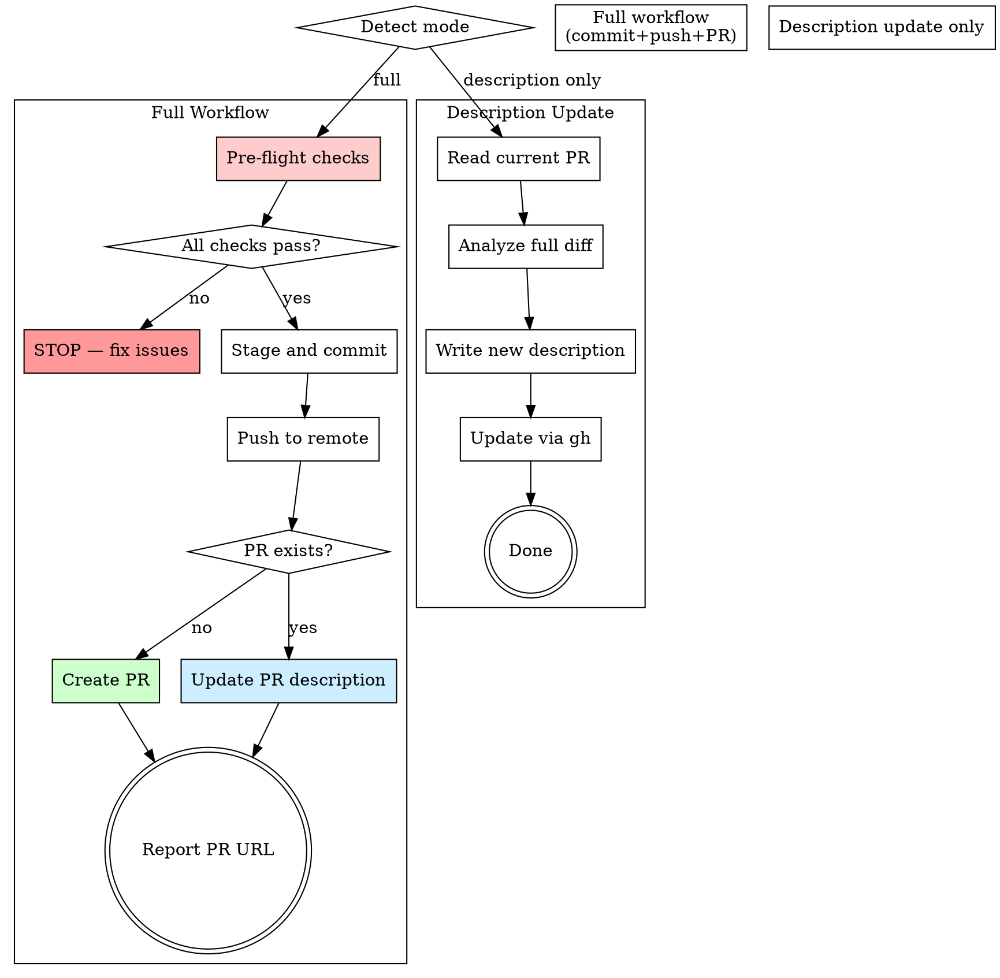

# Ship and PR

From working-tree changes to a merged-ready PR in one workflow. Handles pre-flight validation, commit, push, and PR creation with descriptions that communicate value proportional to change complexity.

**Origin:** Patterns extracted from compound-engineering (git-commit-push-pr value-first descriptions, mode detection) and gstack (ship pre-flight checks, test gate, coverage audit).

## The Iron Law

```
NO PR WITHOUT PRE-FLIGHT CHECKS PASSING
```

A PR opened with failing tests, uncommitted changes mixed with other work, or no description is a PR that wastes reviewer time. Pre-flight is non-negotiable.

## When to Use

- After `structured-review` passes (verdict: PASS or PASS WITH NOTES)
- After `superpowers:finishing-a-development-branch` chooses the PR path
- When the user says "ship it", "create a PR", "push and open PR"
- To update an existing PR description

## Process Flow



## Step 0: Detect Mode

| Mode | Trigger | Behavior |
|------|---------|----------|
| **Full workflow** | Uncommitted changes exist, or user says "ship", "push", "create PR" | Pre-flight → commit → push → PR |
| **Description update** | User says "update the PR description", or PR already exists with no changes | Read diff → write description → update PR |

## Step 1: Pre-Flight Checks (Full Workflow Only)

Run all checks. ALL must pass before proceeding.

```bash
echo "=== Pre-flight Checks ==="

# 1. On a feature branch (not main/master)?
BRANCH=$(git branch --show-current)
echo "Branch: $BRANCH"

# 2. Base branch detection
BASE=$(git rev-parse --abbrev-ref HEAD@{upstream} 2>/dev/null | sed 's|origin/||' || echo "")
if [ -z "$BASE" ]; then
  BASE=$(git remote show origin 2>/dev/null | grep 'HEAD branch' | awk '{print $NF}' || echo "main")
fi
echo "Base: $BASE"

# 3. Are there changes to ship?
git diff "origin/$BASE" --stat
```

### Pre-flight Gate

| Check | How | Fail action |
|-------|-----|-------------|
| **Not on base branch** | `$BRANCH != main/master` | STOP — "You're on the base branch. Create a feature branch first." |
| **Changes exist** | `git diff origin/$BASE --stat` is non-empty | STOP — "No changes to ship." |
| **Tests pass** | Run the project's test command | STOP — "Tests failing. Fix before shipping." |
| **No merge conflicts** | `git merge-base --is-ancestor origin/$BASE HEAD` | WARN — "Branch may have conflicts with base. Consider rebasing." |

### Finding the test command

Check these locations in order:
1. `CLAUDE.md` or `AGENTS.md` — look for a documented test command
2. `package.json` scripts — `test`, `check`, `ci`
3. `Makefile` — `test`, `check`
4. Common patterns: `bun test`, `npm test`, `pytest`, `go test ./...`, `cargo test`

If no test command can be determined, ask the user. **Do not skip testing.**

Run the test command and verify it exits with code 0.

## Step 2: Gather Context

Collect information for the commit message and PR description:

```bash
# What changed (stat view)
git diff origin/$BASE --stat

# Recent commits on this branch
git log "origin/$BASE..HEAD" --oneline

# Full diff for PR description analysis
git diff "origin/$BASE"
```

## Step 3: Stage and Commit

### Staging

Stage files relevant to the current work. **Never use `git add .` or `git add -A`** — these can accidentally include secrets, large binaries, or unrelated changes.

```bash
# Review what's unstaged
git status --short

# Stage specific files
git add <file1> <file2> ...
```

If there are unstaged files that look unrelated to the current work, ask the user before staging them.

### Commit Message

Write a commit message that communicates **value, not mechanics**:

**Good:** `feat: add retry logic for failed webhook deliveries`
**Bad:** `update webhook.ts`

**Good:** `fix: prevent duplicate charges when payment callback is slow`
**Bad:** `fix bug in payment handler`

Format:
```
<type>(<scope>): <what changed and why>

<optional body: context that helps reviewers understand the change>
```

Types: `feat`, `fix`, `refactor`, `test`, `docs`, `chore`

## Step 4: Push

```bash
git push -u origin "$BRANCH"
```

If push fails due to remote changes, offer to rebase:

```bash
git fetch origin "$BASE" && git rebase "origin/$BASE"
```

After successful rebase, push again. If rebase has conflicts, STOP and let the user resolve them.

## Step 5: Create or Update PR

### Check for existing PR

```bash
gh pr view --json number,title,url 2>/dev/null
```

### If no PR exists: Create

Analyze the full diff to write an adaptive PR description. Scale description detail to change complexity:

| Change Size | Description Style |
|-------------|------------------|
| **Small** (1-3 files, < 50 lines) | 2-3 sentence summary. No sections needed. |
| **Medium** (4-10 files, 50-300 lines) | Summary + What Changed + Testing sections. |
| **Large** (10+ files, 300+ lines) | Full structure: Summary, Motivation, What Changed, How to Test, Screenshots (if UI), Breaking Changes. |

```bash
gh pr create --title "<type>(<scope>): <value description>" --body "$(cat <<'EOF'
## Summary

<1-3 bullets: what this PR does and why>

## What Changed

<grouped by logical concern, not by file>

## How to Test

<specific steps a reviewer can follow>

## Notes for Reviewers

<anything non-obvious: performance considerations, migration steps, etc.>
EOF
)"
```

**PR title rules:**
- Under 70 characters
- Communicates value, not file names
- Same format as commit messages: `type(scope): description`

### If PR exists: Update description

Read the current description, analyze the full diff (including any new commits), and rewrite the description to accurately reflect the current state.

```bash
gh pr edit --body "$(cat <<'EOF'
<updated description>
EOF
)"
```

## Step 6: Report

After PR is created or updated:

```markdown
## Ship Complete

**PR:** <URL>
**Branch:** <branch> → <base>
**Changes:** <N> files, +<added>/-<removed> lines
**Tests:** Passing ✓
**Status:** Ready for review
```

## Step 7: Prior Knowledge Check and Post-Ship Documentation

### 7a: Check for relevant learnings

Before finalizing, scan for prior learnings that affect this shipment:

- Search `docs/learnings/` for learnings tagged with files or modules in this PR
- If a **Pitfall learning** matches → verify the PR doesn't reintroduce the documented issue
- If a **Decision learning** matches → verify the PR is consistent with the documented rationale
- If a conflict is found → flag it in the PR description under "Notes for Reviewers"

### 7b: Post-Ship Documentation Check

After creating the PR, do a quick scan:

1. Does the change affect documented behavior? (README, API docs, CLAUDE.md)
2. If yes, ask: "This change may affect documentation in <files>. Want me to update them in this PR?"
3. If the user approves, make the doc updates, commit, and push to the same branch.

This is inspired by gstack's `/document-release` — docs should never drift from code.

## Red Flags — STOP

| Thought | Reality |
|---------|---------|
| "Tests are probably fine" | Run them. `superpowers:verification-before-completion` is non-negotiable. |
| "I'll add tests later" | Tests ship with code. A PR without tests is incomplete. |
| "Just push to main" | Feature branches exist for a reason. Direct pushes skip review. |
| "The description can be short" | Short is fine for small changes. But "update stuff" helps no one. |
| "I'll force push to clean up" | Force push destroys reviewer context. Prefer new commits. |
| "Skip pre-flight, it's urgent" | Urgency is when pre-flight matters most. Broken deploys are more urgent. |

## Step 8: Knowledge Output Prompt

After the PR is created, ask:

> "This development session is complete. Were there any learnings worth documenting? (debugging insights, architectural decisions, patterns discovered, pitfalls encountered)"

If the user says yes, invoke `knowledge-compound`. If the user says no, respect that — not every session produces learnings.

**Auto-suggest compounding when:** the PR includes bug fixes (suggest Bug track), introduces new patterns (suggest Knowledge track), or makes architectural choices (suggest Decision track).

## Integration with Superpowers

- **Before this skill:** `superpowers:finishing-a-development-branch` decides the integration path
- **Before this skill:** `structured-review` ensures code quality
- **During Step 1:** `superpowers:verification-before-completion` — tests must be verified, not assumed
- **After this skill:** Knowledge capture via `knowledge-compound` if the development had learnings
