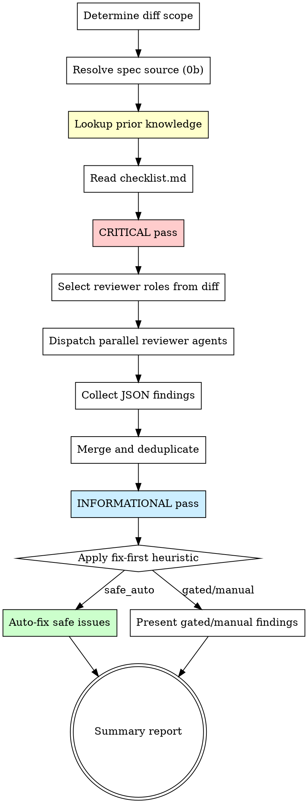

# Structured Code Review

Multi-role parallel code review that catches issues tests miss. Dispatches specialized reviewer agents, merges findings, and applies a fix-first heuristic.

**Origin:** Patterns extracted from compound-engineering (reviewer personas, confidence calibration, JSON contracts) and gstack (two-pass checklist, fix-first heuristic, specialist delegation).

## The Iron Law

```
NO MERGE WITHOUT STRUCTURED REVIEW ON THE DIFF
```

A passing CI is not a review. Tests verify behavior; review catches design flaws, security holes, race conditions, and maintainability traps that tests cannot express.

## When to Use

- Before creating a PR or merging code
- After `superpowers:requesting-code-review` identifies the need for deeper analysis
- When changes touch auth, data models, concurrency, or public APIs
- After completing a task during iterative implementation

## Process Flow



## Step 0: Determine Diff Scope

```bash
git fetch origin "$(git rev-parse --abbrev-ref HEAD@{upstream} 2>/dev/null | sed 's|origin/||' || echo main)" --quiet 2>/dev/null
BASE=$(git merge-base HEAD "origin/$(git rev-parse --abbrev-ref HEAD@{upstream} 2>/dev/null | sed 's|origin/||' || echo main)" 2>/dev/null || echo "HEAD~1")
echo "BASE=$BASE"
git diff "$BASE" --stat
```

If on the base branch with no diff: **"Nothing to review — you're on the base branch."** Stop.

**Fail fast on explicit refs:** if the user names a fixed point ("review since X"), verify it resolves (`git rev-parse --verify X`) and that the diff against it is non-empty BEFORE Step 1. A bad ref or empty diff must fail here — never inside a dispatched reviewer.

### Step 0b: Resolve the Spec Source (Spec axis)

Resolution order — first hit wins:

1. User-provided (a path, issue/PR reference, or pasted spec)
2. The work-item's plan/spec in `docs/plans/` or `docs/specs/` (most recent file matching the diff's scope)
3. An issue/PR referenced by the branch's commit messages
4. T2 work-item and none found → ask the user once

Found → record the path/content for Steps 3–4. None → announce **"Spec axis skipped — no traceable spec"** and continue; the Quality axis is unaffected.

## Step 1: Lookup Prior Knowledge

Follow `learnings-protocol.md` READ phase. Use `docs/learnings/INDEX.md` to scope by changed-files Domain; prefer 📚 synthesis docs. Cite consulted learnings in the reviewer prompt's prior-context section.

Per-skill specifics:
- If a prior **Bug learning** matches a changed area → elevate that area's review priority and include the root cause context in the reviewer agent prompt.
- If a prior **Decision learning** matches → verify the change respects the documented rationale; if it contradicts, flag as a finding.
- If a prior **Knowledge/Pattern learning** matches → include as reference context for reviewers to check compliance.
- Also consult `CLAUDE.md`/`AGENTS.md` for project-specific review conventions and `MEMORY.md` for cross-project patterns.

If no learnings exist or none match: proceed normally. This step is additive, never blocking.

## Step 1b: Read the Checklist

Read `checklist.md` in this skill's directory. It defines the two-pass model (CRITICAL then INFORMATIONAL) and the categories to check.

**If the checklist cannot be read, STOP.** Do not proceed without it.

## Step 2: CRITICAL Pass

Apply CRITICAL categories from the checklist against the full diff. These are issues that **must block merge**:

- SQL & Data Safety
- Race Conditions & Concurrency
- Security & Trust Boundaries
- Shell/Command Injection
- Enum & Value Completeness

Any finding at P0/P1 from the CRITICAL pass is a **merge blocker**.

## Step 3: Select Reviewer Roles

Based on the diff content, select which reviewer agents to dispatch. Not every reviewer runs on every diff — match reviewers to what changed.

### Always-On Reviewers (every diff)

| Reviewer | Triggers on |
|----------|------------|
| `correctness` | All diffs — logic errors, edge cases, state bugs |
| `testing` | All diffs — test coverage gaps, weak assertions |

### Conditional Reviewers (content-triggered)

| Reviewer | Triggers when diff contains |
|----------|----------------------------|
| `security` | Auth, user input handling, public endpoints, secrets, crypto |
| `maintainability` | New abstractions, large files, coupling changes, naming |
| `spec-fidelity` | A traceable spec was resolved in Step 0b (plan, spec doc, or issue for this work-item) |

**Selection rule:** Scan the diff stat and file names. If a conditional reviewer's trigger pattern matches any changed file or hunk, include it. When in doubt, include — a reviewer that finds nothing is cheap; a missed vulnerability is expensive. Exception: `spec-fidelity` is not content-triggered — include it iff Step 0b resolved a spec, regardless of diff content.

## Step 4: Dispatch Parallel Reviewer Agents

For each selected reviewer, dispatch a subagent with:

1. The full diff (or relevant hunks for large diffs)
2. The reviewer's prompt from `reviewers/<name>.md`
3. Instruction to return structured JSON

**Agent dispatch pattern:**

```
For each selected reviewer:
  Spawn Agent with:
    - name: "review-<reviewer_name>"
    - prompt: contents of reviewers/<name>.md + the diff
    - model: use standard model (reviewers need judgment)
    - instruction: "Return findings as JSON. No prose outside JSON."
```

Dispatch all selected reviewers **in parallel** using the Agent tool with multiple concurrent calls.

`spec-fidelity` is the only reviewer with **two inputs**: it additionally receives the resolved spec document (or its relevant sections) alongside the diff, plus any in-session spec revisions the user agreed to (the latest agreed revision is truth).

### JSON Output Contract

Every reviewer returns:

```json
{
  "reviewer": "<name>",
  "findings": [
    {
      "severity": "P0|P1|P2|P3",
      "autofix_class": "safe_auto|gated_auto|manual|advisory",
      "title": "Brief description",
      "file": "path/to/file.ext",
      "line": 42,
      "evidence": ["specific code reference or reasoning"],
      "confidence": 0.85,
      "suggestion": "Concrete fix or recommendation"
    }
  ],
  "residual_risks": ["risks that exist but are not actionable findings"],
  "testing_gaps": ["tests that should exist but don't"]
}
```

## Step 5: Merge and Deduplicate

After all reviewers return:

1. **Deduplicate** — If two reviewers flag the same file+line, keep the higher severity finding. Note both reviewers in the evidence.
2. **Confidence gate** — Suppress findings below threshold:
   - Security findings: suppress below 0.60 (lower bar — missing vulns is costly)
   - All other findings: suppress below 0.75
3. **Conflict resolution** — If reviewers disagree on autofix_class, **choose the more conservative** (safe_auto → gated_auto, never the reverse).
4. **Axis separation** — `spec-fidelity` findings form the **Spec axis**; all other reviewers form the **Quality axis**. Never merge a spec finding with a quality finding and never re-rank across axes — clean code can still build the wrong thing, and one axis must not dilute the other. Deduplication applies within an axis only.
5. **Spec-axis autofix backstop** — a Spec-axis finding marked `safe_auto` is treated as `gated_auto` (implementing a missing item or reverting a contradiction is always a behavior/content change). This enforces the reviewer prompt's "never safe_auto" rule on the orchestrator side too — the single-reviewer axis means rule 3's disagreement path can never fire for it.

## Step 6: INFORMATIONAL Pass

Apply INFORMATIONAL categories from the checklist. These are non-blocking but worth noting:

- Async/Sync consistency
- Field safety (nil/null guards)
- Dead code / unused imports
- Naming consistency
- Error message quality

INFORMATIONAL findings are always P2 or P3.

## Step 7: Apply Fix-First Heuristic

For each finding, determine action:

| `autofix_class` | Action |
|-----------------|--------|
| `safe_auto` | **Auto-fix immediately.** Mechanical, deterministic, no behavior change. Apply the fix, note it in the report. |
| `gated_auto` | **Ask the user.** Concrete fix exists but changes behavior or crosses a sensitive boundary. Present the fix and ask for approval. |
| `manual` | **Report only.** Actionable but requires human judgment or broader context. |
| `advisory` | **Note in report.** Informational — learnings, rollout considerations, residual risk. |

## Step 8: Summary Report

Present a structured report:

```markdown
## Review Summary

**Scope:** <base>..<head> (<N> files changed, +<added>/-<removed>)
**Reviewers:** correctness, security, testing (3 of 5 triggered)
**Spec source:** <path | "none — Spec axis skipped">

### Merge Blockers (P0-P1)
<list or "None">

### Spec Fidelity (Spec axis — when a spec was resolved)
<coverage summary (N claims: implemented/partial/missing/contradicted; unspecced changes) + findings — kept separate from Quality-axis findings>

### Auto-Fixed
<list of safe_auto fixes applied>

### Needs Decision
<gated_auto findings with options>

### Recommended Improvements (P2-P3)
<manual + advisory findings>

### Testing Gaps
<aggregated from all reviewers>

### Verdict: PASS / PASS WITH NOTES / BLOCK
```

**Verdict rules:**
- Any unresolved P0 → **BLOCK**
- Any unresolved P1 → **BLOCK** (unless user explicitly overrides) — a Spec-axis P1 (diff contradicts or omits an explicit spec requirement) blocks exactly like a Quality-axis P1
- Only P2/P3 remaining → **PASS WITH NOTES**
- Nothing found → **PASS**

## Red Flags — STOP

| Thought | Reality |
|---------|---------|
| "Tests pass, no review needed" | Tests verify behavior, not design. Review catches different classes of issues. |
| "It's a small change" | Small changes cause big outages. Size does not correlate with risk. |
| "I'll review it myself" | You wrote it. You have blind spots. Reviewers with different perspectives catch more. |
| "Confidence is low, skip it" | Low confidence on a P0 is still worth investigating. Confidence gates are minimums, not excuses. |
| "Auto-fix everything to save time" | Only `safe_auto` gets auto-fixed. Rushing `gated_auto` into auto-fix causes regressions. |

## Step 9: Knowledge Output

After presenting the report, assess whether the review produced compoundable knowledge:

- **New pattern discovered** (e.g., a recurring issue across multiple files) → suggest `knowledge-compound` with Knowledge track
- **Security finding with broad implications** → suggest `knowledge-compound` with Pitfall track
- **Review contradicted a prior learning** → suggest updating the existing learning via `knowledge-compound`

This step closes the knowledge loop: Step 1 reads prior knowledge, Step 9 writes new knowledge.

## Integration with Superpowers

- **Before this skill:** `superpowers:requesting-code-review` ensures review readiness
- **During execution:** `superpowers:verification-before-completion` — verify auto-fixes actually work
- **After this skill:** `superpowers:finishing-a-development-branch` for merge/PR decisions
